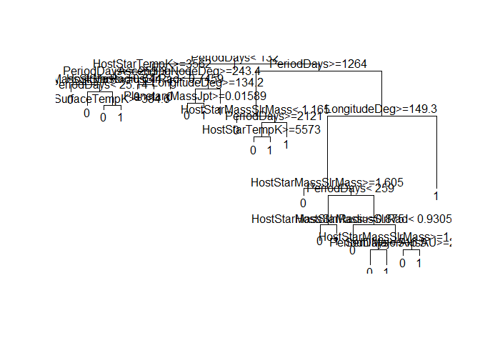

Decision\_Trees\_Exosolar\_Analysis
================
Niket

Decision Tree Model - it is a type of supervised learning algorithm (having a pre-defined target variable). It works for both categorical and continuous input and output variables. Here we split the population or sample into two or more homogeneous set based on most significant splitter / differentiator in input variables.

``` r
#install.packages('caret')
require(caret)
```

    ## Loading required package: caret

    ## Loading required package: lattice

    ## Loading required package: ggplot2

``` r
#install.packages('e1071')
require(e1071)
```

    ## Loading required package: e1071

    ## Warning: package 'e1071' was built under R version 3.4.3

``` r
# load the new dataset
exosim <- read.csv(file.choose(), header = TRUE) # load exos_new-imp2.csv
```

``` r
#### Converting variable Probability_of_life to factor
exosim$Probability_of_life <- as.factor(exosim$Probability_of_life)
table(exosim$Probability_of_life)
```

    ## 
    ##    0    1 
    ## 3256  328

``` r
# So we have 328 planets in our dataset with some probability of life.
```

``` r
label_1 <- exosim$Probability_of_life # our variable for classification
```

``` r
set.seed(1234)
oneortwo <- sample(1:2 , length(exosim$PlanetIdentifier), replace = TRUE, prob=c(0.8, 0.2)) # generating random values and storing them
```

#### Decision Trees

``` r
#install.packages('rattle')
#install.packages('rpart.plot')
#install.packages('RColorBrewer')

library(rpart) #rpart for “Recursive Partitioning and Regression Trees” and uses the CART decision tree algorithm.

# For better insights from rpart plot we import these libraries.
library(rattle)
```

    ## Rattle: A free graphical interface for data science with R.
    ## Version 5.1.0 Copyright (c) 2006-2017 Togaware Pty Ltd.
    ## Type 'rattle()' to shake, rattle, and roll your data.

``` r
library(rpart.plot)
library(RColorBrewer)
```

``` r
# create train data frame
train_2 <- exosim[oneortwo == 1, -26]

# create test data frame
test_2 <- exosim[oneortwo == 2, -26]

# create data frame to apply train and test upon
train_2_label <- label_1[oneortwo == 1]
test_2_label <- label_1[oneortwo == 2]
```

``` r
test_2 <- data.frame(test_2, test_2_label)
head(test_2)
```

    ##    PlanetIdentifier TypeFlag PlanetaryMassJpt RadiusJpt  PeriodDays
    ## 5          14 Her c        0           7.6790 0.3337576  9886.00000
    ## 14   2M 1938+4603 b        1           1.9000 0.5476978   416.00000
    ## 16     2M 2206-20 b        0          30.0000 1.3000000  8686.00000
    ## 26         47 UMa d        0           1.6400 0.5948477 14002.00000
    ## 28         51 Peg b        0           0.4600 0.8117291     4.23100
    ## 29         55 Cnc b        2           0.8306 0.8484087    14.65152
    ##    SemiMajorAxisAU Eccentricity PeriastronDeg LongitudeDeg
    ## 5        9.0370000   0.18400000      189.0760     123.7309
    ## 14       0.9200000   0.03529439      124.0494     312.6796
    ## 16       4.4800000   0.00000000      305.9815     125.5342
    ## 26      11.6000000   0.16000000      110.0000     182.2054
    ## 28       0.0520000   0.00000000        0.0000     394.4843
    ## 29       0.1152273   0.00340000       98.0000      61.4400
    ##    AscendingNodeDeg InclinationDeg SurfaceTempK     AgeGyr DiscoveryMethod
    ## 5         332.06693       36.07736    984.87040 -0.1690265              RV
    ## 14        -39.69173       60.46240   1110.16195  3.3509825          timing
    ## 16        247.45334       44.30000   1706.64862  1.0119986         imaging
    ## 26         79.37761       84.42846    944.97441  1.4881797              RV
    ## 28         70.90759       80.00000   1260.30000  1.7192846              RV
    ## 29        204.66873       44.67023    -12.30588  1.7173882              RV
    ##    DiscoveryYear LastUpdated RightAscension    Declination
    ## 5           2006    15/09/21       16 10 23      +43 49 18
    ## 14          2015    15/06/11     19 38 32.6      +46 03 59
    ## 16          2010   12/1/2020   22 06 22.802   -20 47 05.90
    ## 26          2010    15/09/24 10 59 27.97282 +40 25 48.9202
    ## 28          1995    15/05/24       22 57 27      +20 46 07
    ## 29          1996    15/01/26 08 52 35.81093 +28 19 50.9511
    ##    DistFromSunParsec HostStarMassSlrMass HostStarRadiusSlrRad
    ## 5             18.100           1.0000000             0.708000
    ## 14          1535.261           0.9336037             3.916356
    ## 16            26.670           0.1300000             0.110000
    ## 26            14.063           1.0630000             1.240000
    ## 28            14.700           1.0400000             1.266000
    ## 29            12.340           0.9600000             0.960000
    ##    HostStarMetallicity HostStarTempK HostStarAgeGyr
    ## 5            0.4300000      5311.000      -0.323214
    ## 14          -0.2082313      5902.389      12.656700
    ## 16          -0.1145526      2350.000      10.525851
    ## 26          -0.0190000      5818.700       6.480000
    ## 28           0.2000000      5793.000      -1.350030
    ## 29           0.3000000      5219.000       7.638143
    ##                                         ListsPlanetIsOn test_2_label
    ## 5                                         Controversial            0
    ## 14 Confirmed planets, Planets in binary systems, P-type            0
    ## 16                                    Confirmed planets            0
    ## 26                                    Confirmed planets            0
    ## 28                                    Confirmed planets            0
    ## 29 Confirmed planets, Planets in binary systems, S-type            0

``` r
train_2 <- data.frame(train_2, train_2_label)
head(train_2)
```

    ##   PlanetIdentifier TypeFlag PlanetaryMassJpt RadiusJpt PeriodDays
    ## 1         11 Com b        0           19.400 3.1797009     326.03
    ## 2         11 UMi b        0           11.200 3.1170968     516.22
    ## 3         14 And b        0            4.800 2.0633377     185.84
    ## 4         14 Her b        0            4.975 0.5384652    1766.00
    ## 6     16 Cygni B b        2            1.770 0.4955528     799.50
    ## 7         18 Del b        0           10.300 1.2788760     993.30
    ##   SemiMajorAxisAU Eccentricity PeriastronDeg LongitudeDeg AscendingNodeDeg
    ## 1           1.290        0.231         94.80     412.1695        -84.18270
    ## 2           1.540        0.080        117.63     433.2336        237.05636
    ## 3           0.830        0.000          0.00     573.4702        -95.38436
    ## 4           2.864        0.359         22.23     225.7752        106.85216
    ## 6           1.720        0.689         83.40     138.8458         12.08289
    ## 7           2.600        0.080        166.10     371.0341         44.06583
    ##   InclinationDeg SurfaceTempK     AgeGyr DiscoveryMethod DiscoveryYear
    ## 1      115.91938    -193.6209  1.2228196              RV          2008
    ## 2      114.26185     314.5210  1.9629923              RV          2009
    ## 3       91.81061    1049.3658  2.0520723              RV          2008
    ## 4       78.13019     490.0958 -0.4179759              RV          2002
    ## 6       45.00000    -673.7166  2.8587659              RV          1996
    ## 7       71.90324     273.7105  0.8739372              RV          2008
    ##   LastUpdated RightAscension    Declination DistFromSunParsec
    ## 1    15/09/20       12 20 43      +17 47 34            88.900
    ## 2    15/09/20 15 17 05.88899 +71 49 26.0466           122.100
    ## 3    15/09/20 23 31 17.41346 +39 14 10.3092            79.200
    ## 4    15/09/21       16 10 23      +43 49 18            18.100
    ## 6    15/09/22 19 41 48.95343 +50 31 30.2153            21.146
    ## 7    15/09/23 20 58 25.93397 +10 50 21.4289            75.300
    ##   HostStarMassSlrMass HostStarRadiusSlrRad HostStarMetallicity
    ## 1                2.70               19.000              -0.350
    ## 2                1.80               24.080               0.040
    ## 3                2.20               11.000              -0.240
    ## 4                1.00                0.708               0.430
    ## 6                1.07                1.127               0.052
    ## 7                2.30                8.500              -0.052
    ##   HostStarTempK HostStarAgeGyr
    ## 1          4742       5.246499
    ## 2          4340       1.311730
    ## 3          4813      -2.180942
    ## 4          5311       9.272300
    ## 6          5750       6.800000
    ## 7          4979       0.730065
    ##                                        ListsPlanetIsOn train_2_label
    ## 1                                    Confirmed planets             0
    ## 2                                    Confirmed planets             0
    ## 3                                    Confirmed planets             0
    ## 4                                    Confirmed planets             0
    ## 6 Confirmed planets, Planets in binary systems, S-type             1
    ## 7                                    Confirmed planets             0

``` r
life_predicted_2 <- rpart(train_2_label ~ PlanetaryMassJpt + RadiusJpt + PeriodDays + SemiMajorAxisAU + Eccentricity + PeriastronDeg + LongitudeDeg + AscendingNodeDeg + InclinationDeg + SurfaceTempK + AgeGyr + DiscoveryYear + DistFromSunParsec + HostStarMassSlrMass + HostStarRadiusSlrRad + HostStarMetallicity + HostStarTempK + HostStarAgeGyr + TypeFlag + DiscoveryMethod + ListsPlanetIsOn, data = train_2, method = "class")

# to predict a continuous variable, use method = "anova". But here, we want a one or a zero, so method = "class"
```

``` r
# Examine life_predicted_2
plot(life_predicted_2)
text(life_predicted_2)
```



``` r
fancyRpartPlot(life_predicted_2) # This gives better plot
```


We can see here that the model has considered 'Peiod of Days &lt; 132' for split. Decision tree splits the nodes on all available variables and then selects the split which results in most homogeneous sub-nodes. Our Root Node has a ratio of .91 to .09 on 0(No Life). The consecutive Decision Nodes are HostStarTempK and PeriodDays&gt;=1254. We have 23 Terminal Nodes.

``` r
prediction_2 <- predict(life_predicted_2, test_2, type = "class")
```

``` r
results_2 <- data.frame(prediction_2, test_2$test_2_label)
 
accuracy_2  <- paste("Accuracy of Decision Tree Model is:", sum(prediction_2 == test_2$test_2_label)/length(prediction_2))
decisiontree <- sum(prediction_2 == test_2$test_2_label)/length(prediction_2)

confusionMatrix(table(results_2))
```

    ## Confusion Matrix and Statistics
    ## 
    ##             test_2.test_2_label
    ## prediction_2   0   1
    ##            0 634  15
    ##            1  20  47
    ##                                           
    ##                Accuracy : 0.9511          
    ##                  95% CI : (0.9327, 0.9657)
    ##     No Information Rate : 0.9134          
    ##     P-Value [Acc > NIR] : 7.73e-05        
    ##                                           
    ##                   Kappa : 0.7019          
    ##  Mcnemar's Test P-Value : 0.499           
    ##                                           
    ##             Sensitivity : 0.9694          
    ##             Specificity : 0.7581          
    ##          Pos Pred Value : 0.9769          
    ##          Neg Pred Value : 0.7015          
    ##              Prevalence : 0.9134          
    ##          Detection Rate : 0.8855          
    ##    Detection Prevalence : 0.9064          
    ##       Balanced Accuracy : 0.8637          
    ##                                           
    ##        'Positive' Class : 0               
    ## 

We get accuracy of 95.11% which is far better than KNN model. We can prune our model to avoid overfitting if any, or we can jump to Random Forest which betters the accuracy, as it constructs several decision trees on several variables and than does classification.

------------------------------------------------------------------------
