Exosolar Exploratory Analysis
================
Niket

Exosolar Exploratory Analysis
=============================

``` r
# packages to be preinstalled with the libraries used in this project.

#install.packages("ggplot2")
library(ggplot2)
#library(ggthemes)

#install.packages("dplyr")
library(dplyr)
```

    ## 
    ## Attaching package: 'dplyr'

    ## The following objects are masked from 'package:stats':
    ## 
    ##     filter, lag

    ## The following objects are masked from 'package:base':
    ## 
    ##     intersect, setdiff, setequal, union

``` r
#library(scales)

#install.packages("Amelia")
#library('Rcpp')
#library('Amelia')

#install.packages('caret')
#require(caret)

#install.packages('e1071')
#require(e1071)

#install.packages("corrr")
#library(corrr)

#install.packages('rattle')
#library(rattle)

#install.packages('rpart.plot')
#library(rpart.plot)
#library(rpart)

#install.packages('RColorBrewer')
#library(RColorBrewer)

#install.packages('xgboost')
#library(xgboost)
#library(readr)
#library(stringr)

#install.packages('randomForest')
#library(randomForest)

#install.packages('gbm')
```

------------------------------------------------------------------------

All variables in the dataset are as follows:

``` r
# "PlanetIdentifier" - Name given to the planet
# "TypeFlag"  - TypeFlag==0,'no known stellar binary companion'
              # TypeFlag==1,'P-type binary (circumbinary)'
              # TypeFlag==2,'S-type binary'
              # TypeFlag==3,'orphan planet'
# "PlanetaryMassJpt"  - Mass of planet (Jupiter mass = 1)
# "RadiusJpt" - Radius of Planet (Jupiter Mass = 1) 
# "PeriodDays"  - To rotatate 1 round around it's parent star       
# "SemiMajorAxisAU"   - Distance from Sun to Earth = 1AU
# "Eccentricity"  - measure of the extent of a deviation of a curve or orbit
# "PeriastronDeg" - the angle nearest to a star in the path of a planet
# "LongitudeDeg" - Mean longitude at a given Epoch (same for all planets in one system)
# "AscendingNodeDeg" - Longitude of the ascending node 
# "InclinationDeg" - Inclination of the orbit 
# "SurfaceTempK"   - Temperature (surface or equilibrium) 
# "AgeGyr" - Age Planet or Star
# "DiscoveryMethod"  - Discovery method of the planet
                    # timing
                    # RV
                    # transit
                    # imaging
                    # microlensing  
# "DiscoveryYear" - Year of the planet's discovery 
# "LastUpdated" - Date of the last (non-trivial) update 
# "RightAscension"  - Right ascension
# "Declination"  - Declination
# "DistFromSunParsec" - Distance of planet from Sun in Parsecs(1 Parsecs = 3.26 light years)
# "HostStarMassSlrMass" - Mass of Star(mass of Sun = 1) 
# "HostStarRadiusSlrRad" - Radius of Star(radius of Sun = 1)
# "HostStarMetallicity" - Stellar metallicity
# "HostStarTempK"  - Host Star Temperature
# "HostStarAgeGyr"  - Age of Host Star In Billion years   
# "ListsPlanetIsOn" -  
         # Confirmed planets 
         # Confirmed planets, Orphan planets 
         # Confirmed planets, Planets in binary systems, P-type 
         # Confirmed planets, Planets in binary systems, P-type, Planets in globular clusters 
         # Confirmed planets, Planets in binary systems, S-type 
         # Confirmed planets, Planets in open clusters 
         # Controversial 
         # Controversial, Planets in binary systems, P-type 
         # Controversial, Planets in binary systems, S-type 
         # Kepler Objects of Interest 
         # Planets in binary systems, S-type, Confirmed planets 
         # Retracted planet candidate 
         # Solar System 
# "Probability_of_life" - For probability of Life = 1
                        # For no probability of Life = 0      
```

------------------------------------------------------------------------

We load the data now.

``` r
exos <- read.csv(file.choose(), header = T)  # load file exos_new.csv
head(exos) # show top 6 observations
```

    ##   PlanetIdentifier TypeFlag PlanetaryMassJpt RadiusJpt PeriodDays
    ## 1         11 Com b        0           19.400        NA     326.03
    ## 2         11 UMi b        0           11.200        NA     516.22
    ## 3         14 And b        0            4.800        NA     185.84
    ## 4         14 Her b        0            4.975        NA    1766.00
    ## 5         14 Her c        0            7.679        NA    9886.00
    ## 6     16 Cygni B b        2            1.770        NA     799.50
    ##   SemiMajorAxisAU Eccentricity PeriastronDeg LongitudeDeg AscendingNodeDeg
    ## 1           1.290        0.231        94.800           NA               NA
    ## 2           1.540        0.080       117.630           NA               NA
    ## 3           0.830        0.000         0.000           NA               NA
    ## 4           2.864        0.359        22.230           NA               NA
    ## 5           9.037        0.184       189.076           NA               NA
    ## 6           1.720        0.689        83.400           NA               NA
    ##   InclinationDeg SurfaceTempK AgeGyr DiscoveryMethod DiscoveryYear
    ## 1             NA           NA     NA              RV          2008
    ## 2             NA           NA     NA              RV          2009
    ## 3             NA           NA     NA              RV          2008
    ## 4             NA           NA     NA              RV          2002
    ## 5             NA           NA     NA              RV          2006
    ## 6             45           NA     NA              RV          1996
    ##   LastUpdated RightAscension    Declination DistFromSunParsec
    ## 1    15/09/20       12 20 43      +17 47 34            88.900
    ## 2    15/09/20 15 17 05.88899 +71 49 26.0466           122.100
    ## 3    15/09/20 23 31 17.41346 +39 14 10.3092            79.200
    ## 4    15/09/21       16 10 23      +43 49 18            18.100
    ## 5    15/09/21       16 10 23      +43 49 18            18.100
    ## 6    15/09/22 19 41 48.95343 +50 31 30.2153            21.146
    ##   HostStarMassSlrMass HostStarRadiusSlrRad HostStarMetallicity
    ## 1                2.70               19.000              -0.350
    ## 2                1.80               24.080               0.040
    ## 3                2.20               11.000              -0.240
    ## 4                1.00                0.708               0.430
    ## 5                1.00                0.708               0.430
    ## 6                1.07                1.127               0.052
    ##   HostStarTempK HostStarAgeGyr
    ## 1          4742             NA
    ## 2          4340             NA
    ## 3          4813             NA
    ## 4          5311             NA
    ## 5          5311             NA
    ## 6          5750            6.8
    ##                                        ListsPlanetIsOn Probability_of_life
    ## 1                                    Confirmed planets                   0
    ## 2                                    Confirmed planets                   0
    ## 3                                    Confirmed planets                   0
    ## 4                                    Confirmed planets                   0
    ## 5                                        Controversial                   0
    ## 6 Confirmed planets, Planets in binary systems, S-type                   1

We have now loaded the data as exos which stands for exosolar.

------------------------------------------------------------------------

Now lets look in detail on this data set we loaded.

``` r
str(exos)
```

    ## 'data.frame':    3584 obs. of  26 variables:
    ##  $ PlanetIdentifier    : Factor w/ 3582 levels "11 Com b","11 UMi b",..: 1 2 3 4 5 6 7 8 9 10 ...
    ##  $ TypeFlag            : int  0 0 0 0 0 2 0 0 0 0 ...
    ##  $ PlanetaryMassJpt    : num  19.4 11.2 4.8 4.97 7.68 ...
    ##  $ RadiusJpt           : num  NA NA NA NA NA NA NA 1.7 NA NA ...
    ##  $ PeriodDays          : num  326 516 186 1766 9886 ...
    ##  $ SemiMajorAxisAU     : num  1.29 1.54 0.83 2.86 9.04 ...
    ##  $ Eccentricity        : num  0.231 0.08 0 0.359 0.184 0.689 0.08 NA 0.8 0.09 ...
    ##  $ PeriastronDeg       : num  94.8 117.6 0 22.2 189.1 ...
    ##  $ LongitudeDeg        : num  NA NA NA NA NA NA NA NA NA NA ...
    ##  $ AscendingNodeDeg    : num  NA NA NA NA NA NA NA NA NA NA ...
    ##  $ InclinationDeg      : num  NA NA NA NA NA 45 NA NA NA NA ...
    ##  $ SurfaceTempK        : num  NA NA NA NA NA NA NA 2000 NA NA ...
    ##  $ AgeGyr              : num  NA NA NA NA NA NA NA NA NA NA ...
    ##  $ DiscoveryMethod     : Factor w/ 6 levels "","imaging","microlensing",..: 4 4 4 4 4 4 4 2 6 4 ...
    ##  $ DiscoveryYear       : int  2008 2009 2008 2002 2006 1996 2008 2008 2007 2010 ...
    ##  $ LastUpdated         : Factor w/ 506 levels "","10/1/2005",..: 347 347 347 348 348 349 350 334 299 350 ...
    ##  $ RightAscension      : Factor w/ 2359 levels "","00 01 18",..: 484 585 2339 619 619 1914 2259 615 550 381 ...
    ##  $ Declination         : Factor w/ 2593 levels "","-00 01 54",..: 703 2579 1006 1596 1596 2480 653 182 373 12 ...
    ##  $ DistFromSunParsec   : num  88.9 122.1 79.2 18.1 18.1 ...
    ##  $ HostStarMassSlrMass : num  2.7 1.8 2.2 1 1 1.07 2.3 0.85 NA 1.54 ...
    ##  $ HostStarRadiusSlrRad: num  19 24.08 11 0.708 0.708 ...
    ##  $ HostStarMetallicity : num  -0.35 0.04 -0.24 0.43 0.43 0.052 -0.052 NA NA -0.03 ...
    ##  $ HostStarTempK       : num  4742 4340 4813 5311 5311 ...
    ##  $ HostStarAgeGyr      : num  NA NA NA NA NA 6.8 NA 0.011 0.016 2.7 ...
    ##  $ ListsPlanetIsOn     : Factor w/ 13 levels "Confirmed planets",..: 1 1 1 1 7 5 1 1 7 1 ...
    ##  $ Probability_of_life : int  0 0 0 0 0 1 0 1 0 0 ...

We see that most of them are numerical, except for few which are factors and integers. “num” denotes that the variable “count” is numeric (continuous), and “Factor” denotes that the variable “spray” is categorical with 6 or more categories or levels, and "int" denotes that the variable "count" is numeric(discrete). For more information on each variable we get the summary.

``` r
summary(exos)
```

    ##      PlanetIdentifier    TypeFlag       PlanetaryMassJpt    RadiusJpt     
    ##  Kepler-953 b:   2    Min.   :0.00000   Min.   :  0.000   Min.   :0.0023  
    ##  Kepler-953 c:   2    1st Qu.:0.00000   1st Qu.:  0.150   1st Qu.:0.1411  
    ##  11 Com b    :   1    Median :0.00000   Median :  0.940   Median :0.2096  
    ##  11 UMi b    :   1    Mean   :0.09766   Mean   :  2.891   Mean   :0.3712  
    ##  14 And b    :   1    3rd Qu.:0.00000   3rd Qu.:  2.500   3rd Qu.:0.3215  
    ##  14 Her b    :   1    Max.   :3.00000   Max.   :263.000   Max.   :6.0000  
    ##  (Other)     :3576                      NA's   :2271      NA's   :810     
    ##    PeriodDays       SemiMajorAxisAU     Eccentricity    PeriastronDeg    
    ##  Min.   :     0.1   Min.   :  0.0044   Min.   :0.0000   Min.   :-233.00  
    ##  1st Qu.:     4.8   1st Qu.:  0.0530   1st Qu.:0.0200   1st Qu.:  66.75  
    ##  Median :    13.1   Median :  0.1695   Median :0.1000   Median : 139.70  
    ##  Mean   :   537.2   Mean   :  2.0002   Mean   :0.1669   Mean   : 150.36  
    ##  3rd Qu.:    49.5   3rd Qu.:  1.2500   3rd Qu.:0.2473   3rd Qu.: 243.00  
    ##  Max.   :320000.0   Max.   :662.0000   Max.   :0.9560   Max.   : 791.00  
    ##  NA's   :99         NA's   :2178       NA's   :2476     NA's   :3256     
    ##   LongitudeDeg     AscendingNodeDeg  InclinationDeg      SurfaceTempK   
    ##  Min.   :-174.64   Min.   : -5.113   Min.   : -0.0005   Min.   : 102.2  
    ##  1st Qu.:  37.17   1st Qu.:  1.510   1st Qu.: 85.0580   1st Qu.: 321.8  
    ##  Median : 162.28   Median : 69.821   Median : 87.8000   Median : 719.6  
    ##  Mean   : 144.20   Mean   : 90.624   Mean   : 82.9738   Mean   : 871.7  
    ##  3rd Qu.: 252.63   3rd Qu.:169.175   3rd Qu.: 89.1400   3rd Qu.:1310.9  
    ##  Max.   : 339.30   Max.   :320.800   Max.   :305.0000   Max.   :7112.0  
    ##  NA's   :3541      NA's   :3538      NA's   :2919       NA's   :2843    
    ##      AgeGyr          DiscoveryMethod DiscoveryYear     LastUpdated  
    ##  Min.   :0.006               :  63   Min.   :1781   16/05/10 :1283  
    ##  1st Qu.:0.754   imaging     :  52   1st Qu.:2013   14/02/26 : 726  
    ##  Median :1.503   microlensing:  40   Median :2014   11/9/2012:  38  
    ##  Mean   :1.503   RV          : 692   Mean   :2013   14/02/24 :  34  
    ##  3rd Qu.:2.251   timing      :  25   3rd Qu.:2016   15/12/03 :  25  
    ##  Max.   :3.000   transit     :2712   Max.   :2017   15/12/06 :  24  
    ##  NA's   :3582                        NA's   :10     (Other)  :1454  
    ##   RightAscension       Declination   DistFromSunParsec 
    ##          :  10               :  10   Min.   :   1.295  
    ##  01 37 54:   9   -60 30 42   :   9   1st Qu.:  60.000  
    ##  17 18 57:   7   -34 59 23   :   8   Median : 333.000  
    ##  18 57 44:   7   -05 02 36.44:   7   Mean   : 554.912  
    ##  19 16 18:   7   +38 20 37   :   7   3rd Qu.: 773.130  
    ##  19 19 26:   7   +49 18 19   :   7   Max.   :8500.000  
    ##  (Other) :3537   (Other)     :3536   NA's   :1451      
    ##  HostStarMassSlrMass HostStarRadiusSlrRad HostStarMetallicity
    ##  Min.   :0.0120      Min.   : 0.000       Min.   :-2.0900    
    ##  1st Qu.:0.8300      1st Qu.: 0.810       1st Qu.:-0.0500    
    ##  Median :0.9770      Median : 1.000       Median : 0.0200    
    ##  Mean   :0.9832      Mean   : 1.496       Mean   : 0.0162    
    ##  3rd Qu.:1.1050      3rd Qu.: 1.250       3rd Qu.: 0.1000    
    ##  Max.   :4.5000      Max.   :51.100       Max.   : 0.5600    
    ##  NA's   :168         NA's   :321          NA's   :1075       
    ##  HostStarTempK   HostStarAgeGyr   
    ##  Min.   :  540   Min.   : 0.0022  
    ##  1st Qu.: 5113   1st Qu.: 2.0000  
    ##  Median : 5634   Median : 4.0000  
    ##  Mean   : 5506   Mean   : 4.6354  
    ##  3rd Qu.: 5940   3rd Qu.: 6.3000  
    ##  Max.   :29300   Max.   :80.0000  
    ##  NA's   :129     NA's   :3067     
    ##                                              ListsPlanetIsOn
    ##  Confirmed planets                                   :3295  
    ##  Confirmed planets, Planets in binary systems, S-type: 135  
    ##  Controversial                                       :  72  
    ##  Confirmed planets, Planets in binary systems, P-type:  21  
    ##  Controversial, Planets in binary systems, S-type    :  20  
    ##  Confirmed planets, Planets in open clusters         :  13  
    ##  (Other)                                             :  28  
    ##  Probability_of_life
    ##  Min.   :0.00000    
    ##  1st Qu.:0.00000    
    ##  Median :0.00000    
    ##  Mean   :0.09152    
    ##  3rd Qu.:0.00000    
    ##  Max.   :1.00000    
    ## 

Here we can see that there are many values which are NA. Now either we have to replace these NA values, or delete them, or get out our results without doing anything.

``` r
dim(exos) # Use dim() to obtain the number of rows and columns of data frame.
```

    ## [1] 3584   26

``` r
names(exos) # The names() function will return the column headers.
```

    ##  [1] "PlanetIdentifier"     "TypeFlag"             "PlanetaryMassJpt"    
    ##  [4] "RadiusJpt"            "PeriodDays"           "SemiMajorAxisAU"     
    ##  [7] "Eccentricity"         "PeriastronDeg"        "LongitudeDeg"        
    ## [10] "AscendingNodeDeg"     "InclinationDeg"       "SurfaceTempK"        
    ## [13] "AgeGyr"               "DiscoveryMethod"      "DiscoveryYear"       
    ## [16] "LastUpdated"          "RightAscension"       "Declination"         
    ## [19] "DistFromSunParsec"    "HostStarMassSlrMass"  "HostStarRadiusSlrRad"
    ## [22] "HostStarMetallicity"  "HostStarTempK"        "HostStarAgeGyr"      
    ## [25] "ListsPlanetIsOn"      "Probability_of_life"

We see that we have 3584 observations spread around 25 variables. We can find detailed explaination on each variable in the documentation.

``` r
# Basic Scatterplot Matrix
pairs(~PlanetaryMassJpt + RadiusJpt + PeriodDays + SurfaceTempK + DiscoveryYear + DistFromSunParsec + HostStarMassSlrMass + HostStarRadiusSlrRad + HostStarTempK, data = exos)
```

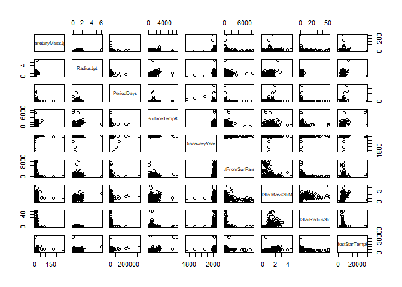 Basic Scatterplot Matrix between the given variables.

------------------------------------------------------------------------

Now let's begin with in-depth analysis of these variables.

------------------------------------------------------------------------

### TypeFlag

``` r
summary(exos$TypeFlag)
```

    ##    Min. 1st Qu.  Median    Mean 3rd Qu.    Max. 
    ## 0.00000 0.00000 0.00000 0.09766 0.00000 3.00000

First of all we see that the variable TypeFlag has only 4 values; 0, 1, 2, 3. We can rename the observations accordingly.

``` r
exos$TypeFlag <- ifelse(exos$TypeFlag==0,'no known stellar binary companion',exos$TypeFlag)
exos$TypeFlag <- ifelse(exos$TypeFlag==1,'P-type binary (circumbinary)',exos$TypeFlag)
exos$TypeFlag <- ifelse(exos$TypeFlag==2,'S-type binary',exos$TypeFlag)
exos$TypeFlag <- ifelse(exos$TypeFlag==3,'orphan planet (no star)',exos$TypeFlag)
```

``` r
summary(exos$TypeFlag)
```

    ##    Length     Class      Mode 
    ##      3584 character character

Now we can see number of observations in TypeFlag using table()

``` r
levels(as.factor(exos$TypeFlag)) # looking at levels as factors.
```

    ## [1] "no known stellar binary companion" "orphan planet (no star)"          
    ## [3] "P-type binary (circumbinary)"      "S-type binary"

``` r
table(exos$TypeFlag)
```

    ## 
    ## no known stellar binary companion           orphan planet (no star) 
    ##                              3396                                 3 
    ##      P-type binary (circumbinary)                     S-type binary 
    ##                                29                               156

------------------------------------------------------------------------

#### Converting variable Probability\_of\_life to factor

``` r
exos$Probability_of_life <- as.factor(exos$Probability_of_life)
table(exos$Probability_of_life)
```

    ## 
    ##    0    1 
    ## 3256  328

``` r
# So we have 328 planets in our dataset with some probability of life.
# 0  means No Life, 1 means Life
```

------------------------------------------------------------------------

#### Create a normalization function

``` r
# we can normalize the data 

#normalize_risk_h_numerical <- sapply(risk_h_numerical, function(x) {
#(x - min(x))/(max(x) - min(x))})

normalize <- function(x) {
return((x - min(x))/(max(x) - min(x)))} # create normalize function
```

#### Create a function to remove outliers

``` r
remove_outliers <- function(x, rm_NA = TRUE)
{
  qnt <- quantile(x, probs=c(.25, .75), na.rm = rm_NA)
  H <- 1.5 * IQR(x, na.rm = rm_NA)
  y <- x
  y[x < (qnt[1] - H)] <- NA
  y[x > (qnt[2] + H)] <- NA
  y
}
```

We will call this function later, this will shorten the code.

------------------------------------------------------------------------

### PlanetaryMassJpt

``` r
summary(exos$PlanetaryMassJpt)
```

    ##    Min. 1st Qu.  Median    Mean 3rd Qu.    Max.    NA's 
    ##   0.000   0.150   0.940   2.891   2.500 263.000    2271

``` r
summary(remove_outliers(exos$PlanetaryMassJpt))
```

    ##    Min. 1st Qu.  Median    Mean 3rd Qu.    Max.    NA's 
    ##   0.000   0.084   0.730   1.198   1.800   6.000    2424

``` r
massjptplot <- data.frame(remove_outliers(exos$PlanetaryMassJpt)) # Called the function to remove outliers.
ggplot(data=exos, aes(massjptplot)) + geom_histogram(breaks=seq(0, 10, by=.01), 
                 col="red", 
                 fill="green", 
                 alpha = .2) + 
  labs(title="Histogram for Mass of Planet") +
  labs(x="Mass of Planet(Jupiter = 1)", y="Count") + 
  xlim(c(0,10)) + 
  ylim(c(0,50)) +
  geom_vline(xintercept = 1, linetype = "dashed") +
  annotate("text", label="Jupiter", colour="black", x= 1.5, y = 49) +
  geom_vline(xintercept = 0.0031457007, linetype = "dashed") +
  annotate("text", label="Earth", colour="black", x= 0.1, y = 49)
```

    ## Warning: Removed 2424 rows containing non-finite values (stat_bin).

    ## Warning: Removed 3 rows containing missing values (geom_bar).

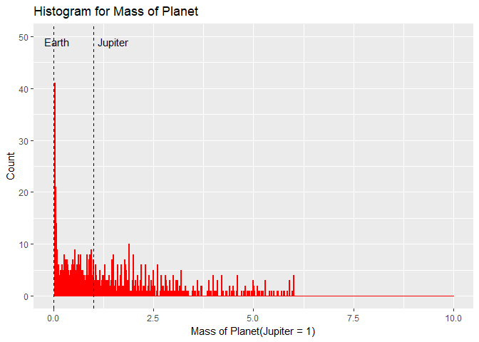

``` r
#boxplot(massjptplot, exos, horizontal = TRUE, axes = TRUE, range = 1,  col = c("red"), xlab = "Planetary Mass(Jupiter Mass)", 
#        ylab = "count", ylim = c(0, 8), las = 2)

ggplot(exos, aes(1, massjptplot)) +
      geom_boxplot(col = "red") +
  ggtitle("Boxplot of Planetary Mass(Jupiter Mass)") +
  coord_flip()
```

    ## Don't know how to automatically pick scale for object of type data.frame. Defaulting to continuous.

    ## Warning: Removed 2424 rows containing non-finite values (stat_boxplot).

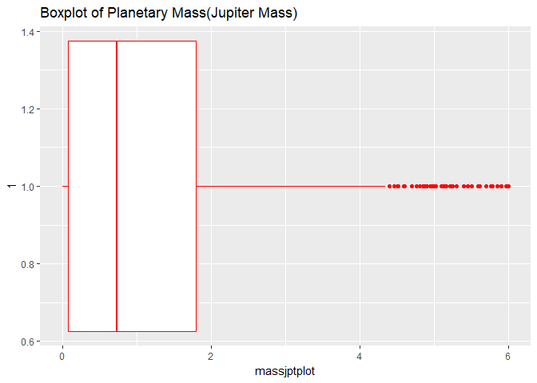 The plot of the mass with the outliers was not very useful. But the main bulk of the planets is within the much smaller range, so removed the outliers. There are still many extremely massive planets . But still, the largest bin is around Earth’s mass.

------------------------------------------------------------------------

### RadiusJpt

``` r
summary(exos$RadiusJpt)
```

    ##    Min. 1st Qu.  Median    Mean 3rd Qu.    Max.    NA's 
    ##  0.0023  0.1411  0.2096  0.3712  0.3215  6.0000     810

``` r
ggplot(data=exos, aes(exos$RadiusJpt)) + geom_histogram(aes(colour = Probability_of_life),breaks=seq(0, 5, by=.01), 
                 #col="red", 
                 #fill="green", 
                 alpha = .2) + 
  labs(title="Histogram for Radius of Planet") +
  labs(x="Radius of Planet(Jupiter = 1)", y="Count") + 
  xlim(c(0,5)) + 
  ylim(c(0,50)) +
  geom_vline(xintercept = 1, linetype = "dashed") +
  annotate("text", label="Jupiter", colour="black", x= 1.5, y = 49) +
  geom_vline(xintercept = 0.091130294, linetype = "dashed") +
  annotate("text", label="Earth", colour="black", x= 0.1, y = 49)
```

    ## Warning: Removed 811 rows containing non-finite values (stat_bin).

    ## Warning: Removed 19 rows containing missing values (geom_bar).

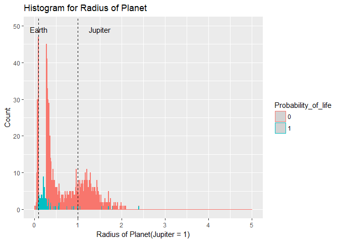

``` r
# boxplot(exos$RadiusJpt,horizontal=TRUE,axes=TRUE,range = 1, col = c("red"), xlab = "Boxplot for Radius of Planet")

ggplot(exos, aes(1, RadiusJpt)) +
      geom_boxplot(col = "red") +
  ggtitle("Boxplot of Radius of Planet") +
  coord_flip()
```

    ## Warning: Removed 810 rows containing non-finite values (stat_boxplot).

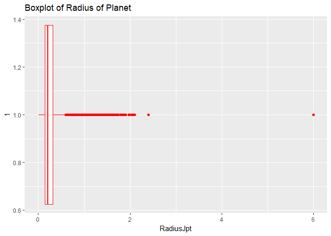

Shape is bimodal. The modes are aroud Earth’s size and Jupiter’s size. Hence maximum planets lies in these sizes(can't say for sure), as there might be some physical law that dictates that planets will tend to form around these two sizes. Also chance of Life = 1 bins are around Earth radius.

------------------------------------------------------------------------

### PeriodDays

``` r
summary(exos$PeriodDays)
```

    ##     Min.  1st Qu.   Median     Mean  3rd Qu.     Max.     NA's 
    ##      0.1      4.8     13.1    537.2     49.5 320000.0       99

We see that a planet takes 320000 days to complete one rotation around it's parent star. They can be termed as outliers.

Let's look at the plots.

``` r
#periodplot <- data.frame(remove_outliers(exos$PeriodDays))
ggplot(data=exos, aes(exos$PeriodDays)) + geom_histogram(aes(colour = Probability_of_life),breaks=seq(0, 5000, by=2), 
                 #col="red", 
                 #fill="green", 
                 alpha = .2) + 
  labs(title="Histogram for Period of Rotation of Planet") +
  labs(x="Rotation Days of Planet", y="Count") + 
  xlim(c(0,5000)) + 
  ylim(c(0,10)) +
  geom_vline(xintercept = 4332.82, linetype = "dashed") +
  annotate("text", label="Jupiter", colour="black", x= 4334, y = 9) +
  geom_vline(xintercept = 365.2422, linetype = "dashed") +
  annotate("text", label="Earth", colour="black", x= 366, y = 9)
```

    ## Warning: Removed 134 rows containing non-finite values (stat_bin).

    ## Warning: Removed 33 rows containing missing values (geom_bar).

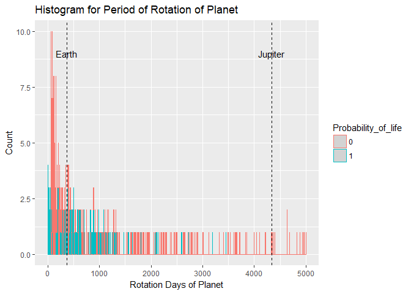

``` r
boxplot(exos$PeriodDays, horizontal=TRUE, axes=TRUE,range = 537.2, col = c("red"))
```

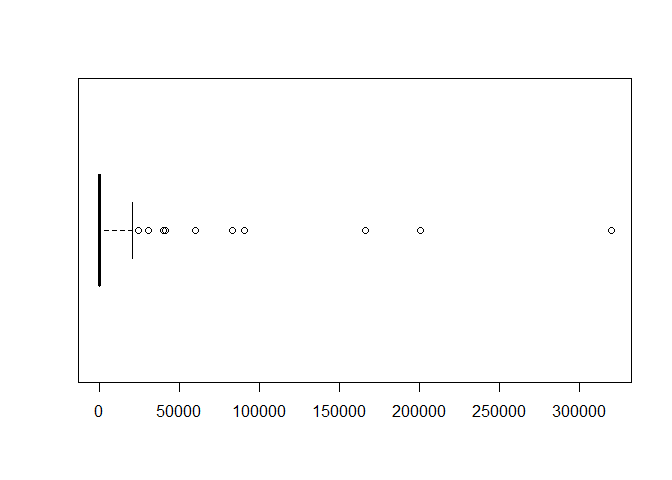

``` r
#ggplot(exos, aes(1, PeriodDays)) +
 #     geom_boxplot(col = "red") +
  #ggtitle("Boxplot of Period of Rotation of Planet)") +
   #coord_flip()
```

Most of the planets have less roation cycle as they tend to be close to their star. Our telescopes are still in infancy to locate planets with more number of rotation.

Also most planets with Life probability take less time rotating around their star, it's true, as most planets were found close to dwarf stars, also habitable zone is always nearby a parent star.

------------------------------------------------------------------------

SurfaceTempK
------------

``` r
summary(exos$SurfaceTempK)
```

    ##    Min. 1st Qu.  Median    Mean 3rd Qu.    Max.    NA's 
    ##   102.2   321.8   719.6   871.7  1310.9  7112.0    2843

``` r
ggplot(data=exos, aes(exos$SurfaceTempK)) + geom_histogram(aes(colour = Probability_of_life), breaks=seq(0, 8000, by=2.5), 
                 #col="red", 
                 #fill="green", 
                 alpha = .2) + 
  labs(title="Histogram for Surface Temperature Planet") +
  labs(x="Surface Temperature", y="Count") + 
  xlim(c(0,8000)) + 
  ylim(c(0,10)) +
  geom_vline(xintercept = 128.15, linetype = "dashed") +
  annotate("text", label="Jupiter", colour="black", x= 50, y = 10) +
  geom_vline(xintercept = 287, linetype = "dashed") +
  annotate("text", label="Earth", colour="black", x= 600, y = 10)
```

    ## Warning: Removed 2843 rows containing non-finite values (stat_bin).

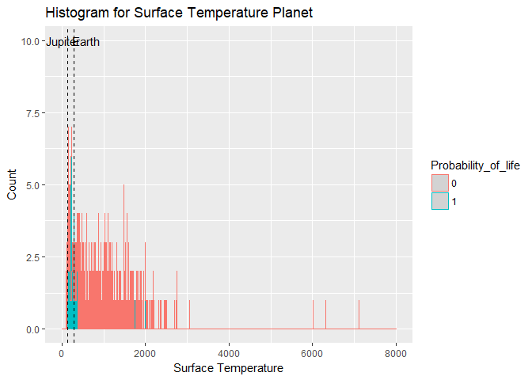

``` r
#hist(exos$SurfaceTempK, 1000)

#boxplot(exos$SurfaceTempK, horizontal=TRUE, axes=TRUE,range = 1, col = c("red"))

ggplot(exos, aes(1, SurfaceTempK)) +
      geom_boxplot(col = "red") +
  ggtitle("Boxplot for Surface Temperature Planet") +
  coord_flip()
```

    ## Warning: Removed 2843 rows containing non-finite values (stat_boxplot).

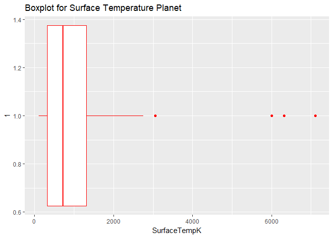

More planets observed have much hotter surface temperatures. We can say that they are much closer to their host star. They cannot be mostly habitable.

Also most planets with Life probability have close to Earth's surface temperature.

------------------------------------------------------------------------

### DiscoveryMethod

``` r
levels(as.factor(exos$DiscoveryMethod))
```

    ## [1] ""             "imaging"      "microlensing" "RV"          
    ## [5] "timing"       "transit"

``` r
exos %>% group_by(DiscoveryMethod) %>% summarise(number_discovered=n())
```

    ## # A tibble: 6 x 2
    ##   DiscoveryMethod number_discovered
    ##            <fctr>             <int>
    ## 1                                63
    ## 2         imaging                52
    ## 3    microlensing                40
    ## 4              RV               692
    ## 5          timing                25
    ## 6         transit              2712

More planets were observed using transit method, as our telescpoes(mainly Kepler) are better at observing the dip in brightness.

``` r
exos$DiscoveryMethod[exos$DiscoveryMethod == '']  <- NA
methodplot <- exos[!is.na(exos$DiscoveryMethod),]

library(scales)

ggplot(methodplot,aes(x = DiscoveryYear, fill = DiscoveryMethod)) +
  geom_line(stat = "bin", binwidth = 2, aes(colour = DiscoveryMethod)) +
  scale_x_continuous(breaks = pretty_breaks(n = 10)) +
  coord_cartesian(xlim =c(1992, 2016)) +
  xlab("Year") + ylab("Planets Discovered") +
  theme(panel.background = element_rect(fill = "white",
        color = "black", size = 0.1),
        axis.text.x = element_text(angle = 45, hjust = 1))
```

    ## Warning: Removed 3 rows containing non-finite values (stat_bin).

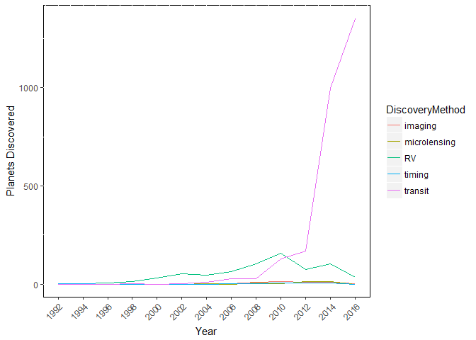

Looks like by using RV and transit we found most amount of planets.

------------------------------------------------------------------------

### DiscoveryYear

``` r
summary(exos$DiscoveryYear)
```

    ##    Min. 1st Qu.  Median    Mean 3rd Qu.    Max.    NA's 
    ##    1781    2013    2014    2013    2016    2017      10

``` r
ggplot(data=exos, aes(exos$DiscoveryYear)) + geom_histogram(aes(colour = Probability_of_life),breaks=seq(1781, 2017, by=2), 
                 #col="red", 
                 #fill="red", 
                 alpha = .2) + 
  labs(title="Histogram for Discovery Year of Planet") +
  labs(x="Year", y="Count") + 
  xlim(c(1781,2017)) + 
  ylim(c(0,1500))
```

    ## Warning: Removed 10 rows containing non-finite values (stat_bin).

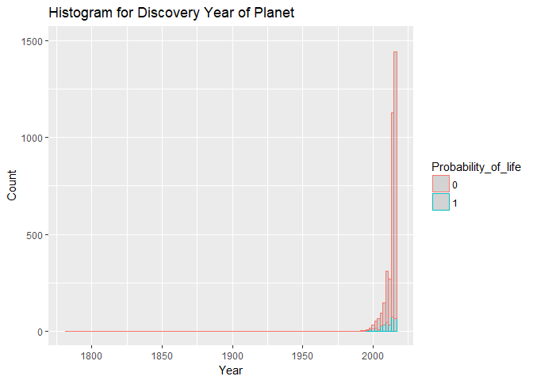

``` r
# hist(exos$DiscoveryYear, 1000)
# boxplot(exos$DiscoveryYear, horizontal=TRUE, axes=TRUE,range = 10, col = "red")
```

After the launch of Kepler Space Telescope and after 2013( when Kepler’s second reaction wheel failed and that the mission had to be replanned) we observed more planets.

Also planets with Life probability were mostly discovered recently due to the advancements in telescopes.

------------------------------------------------------------------------

#### Distribution of Jupiter Masses of these planets?

``` r
massjptplot_1 <- remove_outliers(exos$PlanetaryMassJpt)
ggplot(exos, aes(TypeFlag, massjptplot_1)) +
        geom_boxplot(colour = "red") +
  ggtitle("Boxplot of Mass of Planet vs TypeFlag") +
  coord_flip()
```

    ## Warning: Removed 2424 rows containing non-finite values (stat_boxplot).

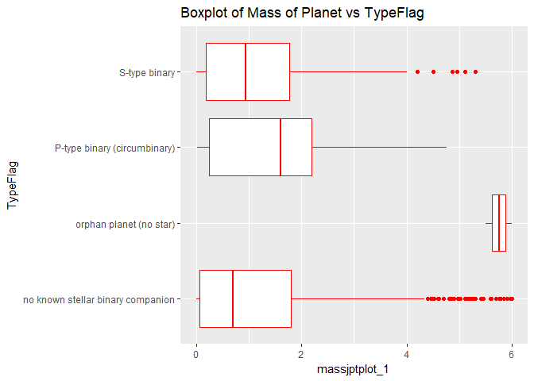

``` r
# varwidth = FALSE, size = 4, colour = "red")  + 
#  scale_x_discrete(name = "Planetary Mass(Jupiter Mass)", breaks = seq(0, 6, 2),limits=c(0, 6)

ggplot(exos, aes(TypeFlag, massjptplot_1)) +
        geom_point(aes(colour = DiscoveryMethod)) +
  ggtitle("Mass of Planet vs TypeFlag") +
  coord_flip()
```

    ## Warning: Removed 2424 rows containing missing values (geom_point).

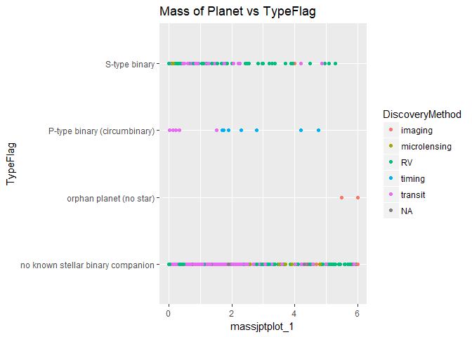

So we can see that our star is an odd compared to others, as most star have a stellar companion.

Planets with higher mass are easily spotted by Transit method.

Massive planets are less which are found orbitting P-type binary(both stars) which is true as more massive the planet, more chace it has to destablize the system, or collide with parent star.

Most of the planets are observed by transit Method.

------------------------------------------------------------------------

#### Discovery methods by Temperature

``` r
ggplot(exos, aes(exos$DiscoveryMethod, exos$SurfaceTempK)) +
      geom_boxplot(col = "red") +
  ggtitle("Boxplot of Planet Temp vs Discovery Method") +
  coord_flip()
```

    ## Warning: Removed 2843 rows containing non-finite values (stat_boxplot).

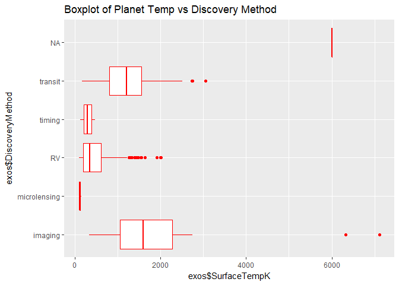

``` r
# size = 4, colour = "red")                               +
# scale_x_discrete(name = "Surface Temperature", breaks = seq(0, 6000, 2),limits=c(0, 6000)        

ggplot(exos, aes(exos$DiscoveryMethod, exos$SurfaceTempK)) +
      geom_point(aes(colour = Probability_of_life)) +
  ggtitle("Planet Temp vs Discovery Method") +
  coord_flip()
```

    ## Warning: Removed 2843 rows containing missing values (geom_point).

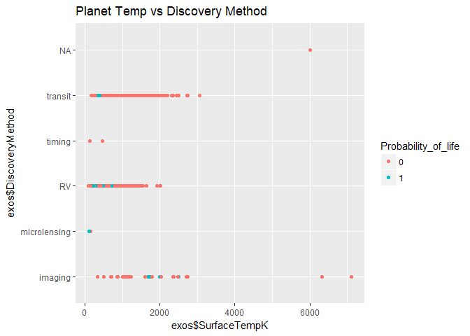

We see that hotter planets were discovered by the imaging method. Microlensing was used for colder planets.

------------------------------------------------------------------------

#### Relationship between SemiMajor Axis and Period

``` r
axpdplot <- select(exos,c(SemiMajorAxisAU,PeriodDays))
axpdplot <- na.omit(axpdplot)
ggplot(axpdplot, aes(x=log(SemiMajorAxisAU), y=log(PeriodDays))) +
  geom_point(col = "red") +
  stat_smooth(method=lm, level=0.95, col = "black") # log to make plot more readable.
```

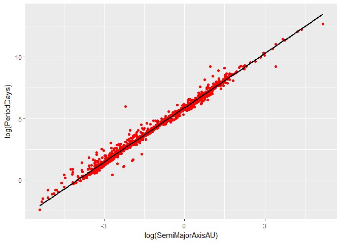 The relationship is linear. We can predict the Period of a planet from the length of its semi-major axis.

------------------------------------------------------------------------

#### Star

------------------------------------------------------------------------

##### Relationship between star mass and star temperature

``` r
mastemplot1 <- select(exos,c(HostStarMassSlrMass,HostStarTempK,Probability_of_life))
mastemplot1 <- na.omit(mastemplot1)
ggplot(mastemplot1,aes(x = log(HostStarMassSlrMass),y = log(HostStarTempK))) + 
  geom_point(aes(colour = Probability_of_life)) +  # log transformation to get readable plot.
  stat_smooth(method = lm, col="black") +
  geom_vline(xintercept = 0.00000001, linetype = "dashed") +
  annotate("text", label="Sun(Sol)", colour="black", x= 0, y = 10)
```

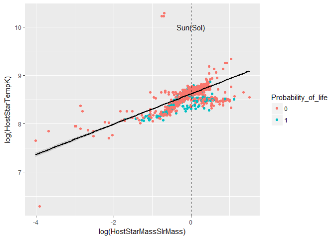

As the mass of the star increases, the temperature of the star also increases.

Also most of the Life probability is around our Sun mass stars.

------------------------------------------------------------------------

##### Relationship between Planet Mass and Host Star Mass

``` r
#create a scatter plot
ggplot(data = exos, aes(x = HostStarMassSlrMass, y = PlanetaryMassJpt)) +
  geom_point(aes(colour = Probability_of_life)) +
  scale_y_continuous("PlanetaryMassJpt", breaks = seq(0,270,10)) +
  geom_vline(xintercept = 1, linetype = "dashed") +
  annotate("text", label="Sun(Sol)", colour="black", x= 1, y = 260) +
  geom_hline(yintercept = 0.003145701, linetype = "dashed") +
  annotate("text", label="Earth", colour="black", x= 4, y = 4)
```

    ## Warning: Removed 2343 rows containing missing values (geom_point).

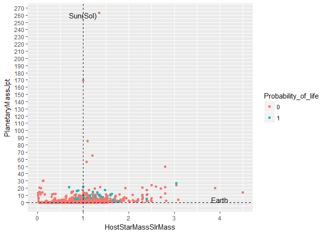

we see that most of the planets with some probabolity of life are somewhat massive than Earth

This is because our telescope technology is not that strong

Also most of them lie between 0.5 to 2 times our Sun mass

At the cross-section of Sun and Earth most planets with Life probability lie.

------------------------------------------------------------------------

### Location and Discovery

#### Distance From Us

``` r
summary(exos$DistFromSunParsec)
```

    ##     Min.  1st Qu.   Median     Mean  3rd Qu.     Max.     NA's 
    ##    1.295   60.000  333.000  554.912  773.130 8500.000     1451

``` r
ggplot(data=exos, aes(exos$DistFromSunParsec)) + 
  geom_histogram(aes(colour = Probability_of_life), breaks=seq(0, 9000, by = 8), 
                 #col="red", 
                 #fill="red", 
                 alpha = .2) + 
  labs(title="Histogram for Discovery Year of Planet") +
  labs(x="Distance(Parsec)", y="Count") + 
  xlim(c(0,9000)) + 
  ylim(c(0,30))
```

    ## Warning: Removed 1451 rows containing non-finite values (stat_bin).

    ## Warning: Removed 10 rows containing missing values (geom_bar).

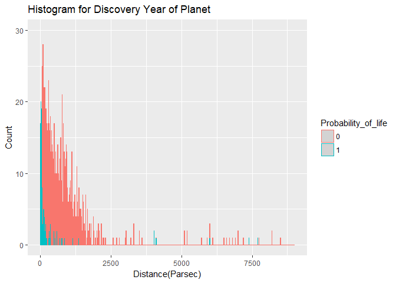

So we discover more planets closer to us as our technology is still in infancy.

And obviously our models and telescopes can predict Life closer to us.

------------------------------------------------------------------------

``` r
# using missing data imputation 'Amelia' package for filling the missing values in our dataset.
#library('Rcpp')
#library('Amelia')
#AmeliaView()
```

------------------------------------------------------------------------

------------------------------------------------------------------------
