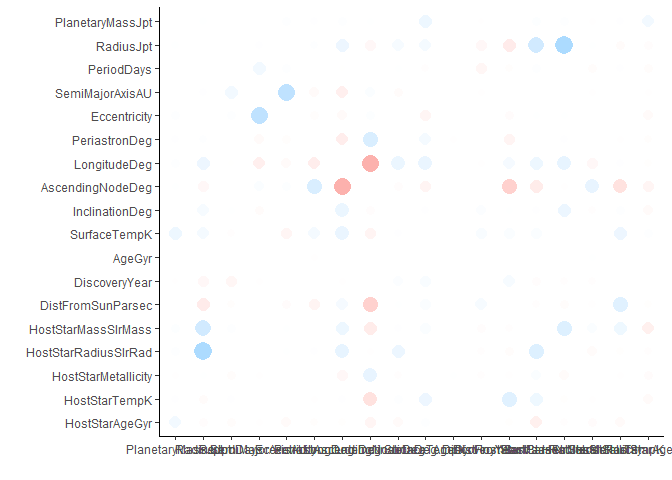

KNN\_Exosolar\_Analysis
================
Niket

KNN Model - When we need classification for a new data, the KNN algorithm goes through the entire dataset to find the k-nearest values to the new data values, or the k number of values most similar to the new record, and then outputs the mode (most frequent class) for a classification problem. The value of k is specified by user.

``` r
# load the new dataset
exosim <- read.csv(file.choose(), header = TRUE) # load exos_new-imp2.csv
```

``` r
#### Converting variable Probability_of_life to factor
exosim$Probability_of_life <- as.factor(exosim$Probability_of_life)
table(exosim$Probability_of_life)
```

    ## 
    ##    0    1 
    ## 3256  328

``` r
# So we have 328 planets in our dataset with some probability of life.
```

#### Create a normalization function

``` r
# we can normalize the data 

normalize <- function(x) {
return((x - min(x))/(max(x) - min(x)))} # create normalize function
```

#### KNN

``` r
exosim_numerical <- subset(exosim, select = c(PlanetaryMassJpt, RadiusJpt, PeriodDays, SemiMajorAxisAU, Eccentricity, PeriastronDeg, LongitudeDeg, AscendingNodeDeg, InclinationDeg, SurfaceTempK, AgeGyr, DiscoveryYear, DistFromSunParsec, HostStarMassSlrMass, HostStarRadiusSlrRad, HostStarMetallicity, HostStarTempK, HostStarAgeGyr))
```

``` r
#install.packages("corrr")
library(corrr)
```

    ## Warning: package 'corrr' was built under R version 3.4.3

    ## Loading required package: dplyr

    ## 
    ## Attaching package: 'dplyr'

    ## The following objects are masked from 'package:stats':
    ## 
    ##     filter, lag

    ## The following objects are masked from 'package:base':
    ## 
    ##     intersect, setdiff, setequal, union

``` r
exosim_numerical %>% correlate() %>% rplot()
```



We see very less correlation between the variables, so we don't have to remove any.

``` r
#### Converting variable Probability_of_life to factor
exosim$Probability_of_life <- as.factor(exosim$Probability_of_life)
table(exosim$Probability_of_life)
```

    ## 
    ##    0    1 
    ## 3256  328

``` r
# So we have 328 planets in our dataset with some probability of life.
```

``` r
label_1 <- exosim$Probability_of_life # our variable for classification
```

``` r
# Categorical variables need to be represented with numbers 
TypeFlag_dummies <- model.matrix( ~ TypeFlag - 1, data = exosim)

DiscoveryMethod_dummies <- model.matrix( ~ DiscoveryMethod - 1, data = exosim)

ListsPlanetIsOn_dummies <- model.matrix( ~ ListsPlanetIsOn - 1, data = exosim)
```

``` r
exosim_numcat <- data.frame(exosim_numerical, TypeFlag_dummies, DiscoveryMethod_dummies, ListsPlanetIsOn_dummies)
```

``` r
str(exosim_numcat)
```

    ## 'data.frame':    3584 obs. of  38 variables:
    ##  $ PlanetaryMassJpt                                                                                 : num  19.4 11.2 4.8 4.97 7.68 ...
    ##  $ RadiusJpt                                                                                        : num  3.18 3.117 2.063 0.538 0.334 ...
    ##  $ PeriodDays                                                                                       : num  326 516 186 1766 9886 ...
    ##  $ SemiMajorAxisAU                                                                                  : num  1.29 1.54 0.83 2.86 9.04 ...
    ##  $ Eccentricity                                                                                     : num  0.231 0.08 0 0.359 0.184 ...
    ##  $ PeriastronDeg                                                                                    : num  94.8 117.6 0 22.2 189.1 ...
    ##  $ LongitudeDeg                                                                                     : num  412 433 573 226 124 ...
    ##  $ AscendingNodeDeg                                                                                 : num  -84.2 237.1 -95.4 106.9 332.1 ...
    ##  $ InclinationDeg                                                                                   : num  115.9 114.3 91.8 78.1 36.1 ...
    ##  $ SurfaceTempK                                                                                     : num  -194 315 1049 490 985 ...
    ##  $ AgeGyr                                                                                           : num  1.223 1.963 2.052 -0.418 -0.169 ...
    ##  $ DiscoveryYear                                                                                    : num  2008 2009 2008 2002 2006 ...
    ##  $ DistFromSunParsec                                                                                : num  88.9 122.1 79.2 18.1 18.1 ...
    ##  $ HostStarMassSlrMass                                                                              : num  2.7 1.8 2.2 1 1 ...
    ##  $ HostStarRadiusSlrRad                                                                             : num  19 24.08 11 0.708 0.708 ...
    ##  $ HostStarMetallicity                                                                              : num  -0.35 0.04 -0.24 0.43 0.43 ...
    ##  $ HostStarTempK                                                                                    : num  4742 4340 4813 5311 5311 ...
    ##  $ HostStarAgeGyr                                                                                   : num  5.246 1.312 -2.181 9.272 -0.323 ...
    ##  $ TypeFlag                                                                                         : num  0 0 0 0 0 2 0 0 0 0 ...
    ##  $ DiscoveryMethod                                                                                  : num  0 0 0 0 0 0 0 0 0 0 ...
    ##  $ DiscoveryMethodimaging                                                                           : num  0 0 0 0 0 0 0 1 0 0 ...
    ##  $ DiscoveryMethodmicrolensing                                                                      : num  0 0 0 0 0 0 0 0 0 0 ...
    ##  $ DiscoveryMethodRV                                                                                : num  1 1 1 1 1 1 1 0 0 1 ...
    ##  $ DiscoveryMethodtiming                                                                            : num  0 0 0 0 0 0 0 0 0 0 ...
    ##  $ DiscoveryMethodtransit                                                                           : num  0 0 0 0 0 0 0 0 1 0 ...
    ##  $ ListsPlanetIsOnConfirmed.planets                                                                 : num  1 1 1 1 0 0 1 1 0 1 ...
    ##  $ ListsPlanetIsOnConfirmed.planets..Orphan.planets                                                 : num  0 0 0 0 0 0 0 0 0 0 ...
    ##  $ ListsPlanetIsOnConfirmed.planets..Planets.in.binary.systems..P.type                              : num  0 0 0 0 0 0 0 0 0 0 ...
    ##  $ ListsPlanetIsOnConfirmed.planets..Planets.in.binary.systems..P.type..Planets.in.globular.clusters: num  0 0 0 0 0 0 0 0 0 0 ...
    ##  $ ListsPlanetIsOnConfirmed.planets..Planets.in.binary.systems..S.type                              : num  0 0 0 0 0 1 0 0 0 0 ...
    ##  $ ListsPlanetIsOnConfirmed.planets..Planets.in.open.clusters                                       : num  0 0 0 0 0 0 0 0 0 0 ...
    ##  $ ListsPlanetIsOnControversial                                                                     : num  0 0 0 0 1 0 0 0 1 0 ...
    ##  $ ListsPlanetIsOnControversial..Planets.in.binary.systems..P.type                                  : num  0 0 0 0 0 0 0 0 0 0 ...
    ##  $ ListsPlanetIsOnControversial..Planets.in.binary.systems..S.type                                  : num  0 0 0 0 0 0 0 0 0 0 ...
    ##  $ ListsPlanetIsOnKepler.Objects.of.Interest                                                        : num  0 0 0 0 0 0 0 0 0 0 ...
    ##  $ ListsPlanetIsOnPlanets.in.binary.systems..S.type..Confirmed.planets                              : num  0 0 0 0 0 0 0 0 0 0 ...
    ##  $ ListsPlanetIsOnRetracted.planet.candidate                                                        : num  0 0 0 0 0 0 0 0 0 0 ...
    ##  $ ListsPlanetIsOnSolar.System                                                                      : num  0 0 0 0 0 0 0 0 0 0 ...

``` r
# normalize 
norm_exosim_numcat <- as.data.frame(sapply(exosim_numcat, normalize))
```

``` r
set.seed(1234)
oneortwo <- sample(1:2 , length(exosim$PlanetIdentifier), replace = TRUE, prob=c(0.8, 0.2)) # generating random values and storing them
```

``` r
# create train data frame
train_1 <- norm_exosim_numcat[oneortwo == 1, ]

# create test data frame
test_1 <- norm_exosim_numcat[oneortwo == 2, ]

# create data frame to apply train and test upon
train_1_label <- label_1[oneortwo == 1]
test_1_label <- label_1[oneortwo == 2]
```

``` r
require(class)  # to use knn algorithm  
```

    ## Loading required package: class

``` r
# splitting the data
set.seed(1234)
life_predicted_1 <- knn(train = train_1, test = test_1, cl = train_1_label, k = 20)
```

``` r
results_1 <- data.frame(life_predicted_1, test_1_label)
#install.packages('caret')
require(caret)
```

    ## Loading required package: caret

    ## Loading required package: lattice

    ## Loading required package: ggplot2

``` r
#install.packages('e1071')
require(e1071)
```

    ## Loading required package: e1071

    ## Warning: package 'e1071' was built under R version 3.4.3

``` r
accuracy_1 <- paste("Accuracy of KNN Model is:", sum(life_predicted_1 == test_1_label)/length(life_predicted_1))
knn <- sum(life_predicted_1 == test_1_label)/length(life_predicted_1)

confusionMatrix(table(results_1))
```

    ## Confusion Matrix and Statistics
    ## 
    ##                 test_1_label
    ## life_predicted_1   0   1
    ##                0 652  59
    ##                1   2   3
    ##                                           
    ##                Accuracy : 0.9148          
    ##                  95% CI : (0.8919, 0.9342)
    ##     No Information Rate : 0.9134          
    ##     P-Value [Acc > NIR] : 0.4808          
    ##                                           
    ##                   Kappa : 0.0776          
    ##  Mcnemar's Test P-Value : 7.496e-13       
    ##                                           
    ##             Sensitivity : 0.99694         
    ##             Specificity : 0.04839         
    ##          Pos Pred Value : 0.91702         
    ##          Neg Pred Value : 0.60000         
    ##              Prevalence : 0.91341         
    ##          Detection Rate : 0.91061         
    ##    Detection Prevalence : 0.99302         
    ##       Balanced Accuracy : 0.52266         
    ##                                           
    ##        'Positive' Class : 0               
    ## 

We get an accuracy of 91.48% which is really good, but has a room for improvemnet.

------------------------------------------------------------------------
