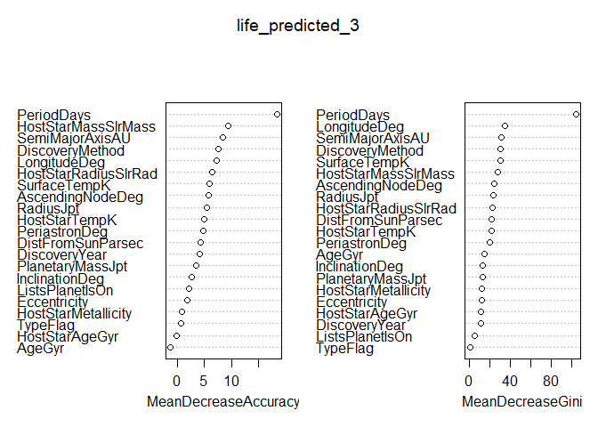
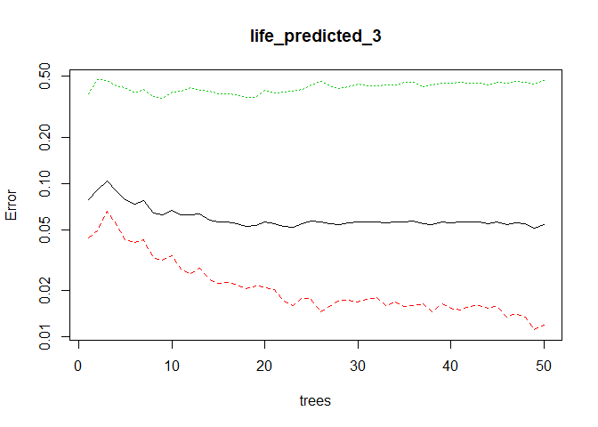
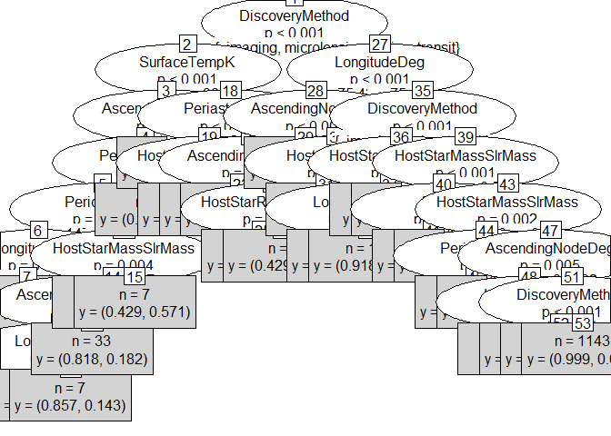

Random\_Forest\_Exosolar\_Analysis
================
Niket

Random Forest Model - Random Forest (multiple learners) is an improvement over bagged decision trees (a single learner). It can handle large data set with higher dimensionality. It can handle thousands of input variables and identify most significant variables so it is considered as one of the dimensionality reduction methods.

``` r
#install.packages('caret')
require(caret)
```

    ## Loading required package: caret

    ## Loading required package: lattice

    ## Loading required package: ggplot2

``` r
#install.packages('e1071')
require(e1071)
```

    ## Loading required package: e1071

    ## Warning: package 'e1071' was built under R version 3.4.3

``` r
# load the new dataset
exosim <- read.csv(file.choose(), header = TRUE) # load exos_new-imp2.csv
```

``` r
#### Converting variable Probability_of_life to factor
exosim$Probability_of_life <- as.factor(exosim$Probability_of_life)
table(exosim$Probability_of_life)
```

    ## 
    ##    0    1 
    ## 3256  328

``` r
# So we have 328 planets in our dataset with some probability of life.
```

``` r
label_1 <- exosim$Probability_of_life # our variable for classification
```

``` r
set.seed(1234)
oneortwo <- sample(1:2 , length(exosim$PlanetIdentifier), replace = TRUE, prob=c(0.8, 0.2)) # generating random values and storing them
```

``` r
# create train data frame
train_2 <- exosim[oneortwo == 1, -26]

# create test data frame
test_2 <- exosim[oneortwo == 2, -26]

# create data frame to apply train and test upon
train_2_label <- label_1[oneortwo == 1]
test_2_label <- label_1[oneortwo == 2]
```

``` r
test_2 <- data.frame(test_2, test_2_label)
head(test_2)
```

    ##    PlanetIdentifier TypeFlag PlanetaryMassJpt RadiusJpt  PeriodDays
    ## 5          14 Her c        0           7.6790 0.3337576  9886.00000
    ## 14   2M 1938+4603 b        1           1.9000 0.5476978   416.00000
    ## 16     2M 2206-20 b        0          30.0000 1.3000000  8686.00000
    ## 26         47 UMa d        0           1.6400 0.5948477 14002.00000
    ## 28         51 Peg b        0           0.4600 0.8117291     4.23100
    ## 29         55 Cnc b        2           0.8306 0.8484087    14.65152
    ##    SemiMajorAxisAU Eccentricity PeriastronDeg LongitudeDeg
    ## 5        9.0370000   0.18400000      189.0760     123.7309
    ## 14       0.9200000   0.03529439      124.0494     312.6796
    ## 16       4.4800000   0.00000000      305.9815     125.5342
    ## 26      11.6000000   0.16000000      110.0000     182.2054
    ## 28       0.0520000   0.00000000        0.0000     394.4843
    ## 29       0.1152273   0.00340000       98.0000      61.4400
    ##    AscendingNodeDeg InclinationDeg SurfaceTempK     AgeGyr DiscoveryMethod
    ## 5         332.06693       36.07736    984.87040 -0.1690265              RV
    ## 14        -39.69173       60.46240   1110.16195  3.3509825          timing
    ## 16        247.45334       44.30000   1706.64862  1.0119986         imaging
    ## 26         79.37761       84.42846    944.97441  1.4881797              RV
    ## 28         70.90759       80.00000   1260.30000  1.7192846              RV
    ## 29        204.66873       44.67023    -12.30588  1.7173882              RV
    ##    DiscoveryYear LastUpdated RightAscension    Declination
    ## 5           2006    15/09/21       16 10 23      +43 49 18
    ## 14          2015    15/06/11     19 38 32.6      +46 03 59
    ## 16          2010   12/1/2020   22 06 22.802   -20 47 05.90
    ## 26          2010    15/09/24 10 59 27.97282 +40 25 48.9202
    ## 28          1995    15/05/24       22 57 27      +20 46 07
    ## 29          1996    15/01/26 08 52 35.81093 +28 19 50.9511
    ##    DistFromSunParsec HostStarMassSlrMass HostStarRadiusSlrRad
    ## 5             18.100           1.0000000             0.708000
    ## 14          1535.261           0.9336037             3.916356
    ## 16            26.670           0.1300000             0.110000
    ## 26            14.063           1.0630000             1.240000
    ## 28            14.700           1.0400000             1.266000
    ## 29            12.340           0.9600000             0.960000
    ##    HostStarMetallicity HostStarTempK HostStarAgeGyr
    ## 5            0.4300000      5311.000      -0.323214
    ## 14          -0.2082313      5902.389      12.656700
    ## 16          -0.1145526      2350.000      10.525851
    ## 26          -0.0190000      5818.700       6.480000
    ## 28           0.2000000      5793.000      -1.350030
    ## 29           0.3000000      5219.000       7.638143
    ##                                         ListsPlanetIsOn test_2_label
    ## 5                                         Controversial            0
    ## 14 Confirmed planets, Planets in binary systems, P-type            0
    ## 16                                    Confirmed planets            0
    ## 26                                    Confirmed planets            0
    ## 28                                    Confirmed planets            0
    ## 29 Confirmed planets, Planets in binary systems, S-type            0

``` r
train_2 <- data.frame(train_2, train_2_label)
head(train_2)
```

    ##   PlanetIdentifier TypeFlag PlanetaryMassJpt RadiusJpt PeriodDays
    ## 1         11 Com b        0           19.400 3.1797009     326.03
    ## 2         11 UMi b        0           11.200 3.1170968     516.22
    ## 3         14 And b        0            4.800 2.0633377     185.84
    ## 4         14 Her b        0            4.975 0.5384652    1766.00
    ## 6     16 Cygni B b        2            1.770 0.4955528     799.50
    ## 7         18 Del b        0           10.300 1.2788760     993.30
    ##   SemiMajorAxisAU Eccentricity PeriastronDeg LongitudeDeg AscendingNodeDeg
    ## 1           1.290        0.231         94.80     412.1695        -84.18270
    ## 2           1.540        0.080        117.63     433.2336        237.05636
    ## 3           0.830        0.000          0.00     573.4702        -95.38436
    ## 4           2.864        0.359         22.23     225.7752        106.85216
    ## 6           1.720        0.689         83.40     138.8458         12.08289
    ## 7           2.600        0.080        166.10     371.0341         44.06583
    ##   InclinationDeg SurfaceTempK     AgeGyr DiscoveryMethod DiscoveryYear
    ## 1      115.91938    -193.6209  1.2228196              RV          2008
    ## 2      114.26185     314.5210  1.9629923              RV          2009
    ## 3       91.81061    1049.3658  2.0520723              RV          2008
    ## 4       78.13019     490.0958 -0.4179759              RV          2002
    ## 6       45.00000    -673.7166  2.8587659              RV          1996
    ## 7       71.90324     273.7105  0.8739372              RV          2008
    ##   LastUpdated RightAscension    Declination DistFromSunParsec
    ## 1    15/09/20       12 20 43      +17 47 34            88.900
    ## 2    15/09/20 15 17 05.88899 +71 49 26.0466           122.100
    ## 3    15/09/20 23 31 17.41346 +39 14 10.3092            79.200
    ## 4    15/09/21       16 10 23      +43 49 18            18.100
    ## 6    15/09/22 19 41 48.95343 +50 31 30.2153            21.146
    ## 7    15/09/23 20 58 25.93397 +10 50 21.4289            75.300
    ##   HostStarMassSlrMass HostStarRadiusSlrRad HostStarMetallicity
    ## 1                2.70               19.000              -0.350
    ## 2                1.80               24.080               0.040
    ## 3                2.20               11.000              -0.240
    ## 4                1.00                0.708               0.430
    ## 6                1.07                1.127               0.052
    ## 7                2.30                8.500              -0.052
    ##   HostStarTempK HostStarAgeGyr
    ## 1          4742       5.246499
    ## 2          4340       1.311730
    ## 3          4813      -2.180942
    ## 4          5311       9.272300
    ## 6          5750       6.800000
    ## 7          4979       0.730065
    ##                                        ListsPlanetIsOn train_2_label
    ## 1                                    Confirmed planets             0
    ## 2                                    Confirmed planets             0
    ## 3                                    Confirmed planets             0
    ## 4                                    Confirmed planets             0
    ## 6 Confirmed planets, Planets in binary systems, S-type             1
    ## 7                                    Confirmed planets             0

#### Random Forest

``` r
#install.packages('randomForest')
library(randomForest)
```

    ## Warning: package 'randomForest' was built under R version 3.4.3

    ## randomForest 4.6-12

    ## Type rfNews() to see new features/changes/bug fixes.

    ## 
    ## Attaching package: 'randomForest'

    ## The following object is masked from 'package:ggplot2':
    ## 
    ##     margin

``` r
set.seed(1234)
```

``` r
life_predicted_3 <- randomForest(train_2_label ~ PlanetaryMassJpt + RadiusJpt + PeriodDays + SemiMajorAxisAU + Eccentricity + PeriastronDeg + LongitudeDeg + AscendingNodeDeg + InclinationDeg + SurfaceTempK + AgeGyr + DiscoveryYear + DistFromSunParsec + HostStarMassSlrMass + HostStarRadiusSlrRad + HostStarMetallicity + HostStarTempK + HostStarAgeGyr + TypeFlag + DiscoveryMethod + ListsPlanetIsOn , data = train_2, importance = TRUE, ntree = 50) 
```

We want enough trees to stabilize the error but not so many that they over correlate the ensemble, which will lead to overfit so we keep ntree = 50.

``` r
varImpPlot(life_predicted_3)
```



Higher the value of Gini higher the homogeneity. So split occurs accordingly.

``` r
plot(life_predicted_3, log="y")
```



Across 50 trees the error rate decreased, we might increase the number of trees for more decreased error, but avoid it because of overfitting.

``` r
library("party")
```

    ## Loading required package: grid

    ## Loading required package: mvtnorm

    ## Loading required package: modeltools

    ## Loading required package: stats4

    ## Loading required package: strucchange

    ## Loading required package: zoo

    ## 
    ## Attaching package: 'zoo'

    ## The following objects are masked from 'package:base':
    ## 
    ##     as.Date, as.Date.numeric

    ## Loading required package: sandwich

``` r
x <- ctree(train_2_label ~ PlanetaryMassJpt + RadiusJpt + PeriodDays + SemiMajorAxisAU + Eccentricity + PeriastronDeg + LongitudeDeg + AscendingNodeDeg + InclinationDeg + SurfaceTempK + AgeGyr + DiscoveryYear + DistFromSunParsec + HostStarMassSlrMass + HostStarRadiusSlrRad + HostStarMetallicity + HostStarTempK + HostStarAgeGyr + TypeFlag + DiscoveryMethod + ListsPlanetIsOn , data = train_2)
plot(x, type="simple")
```



Here we see the splitting at Discovery Method. This plot has few good aspects. Like on 20th Terminal Node when the value of HostStarRadius is &lt;=1 , the y has value of 88.4% for Life = 1. Same results can be seen on 25, 37 termnal node, Also for transit we have 99% and transit 92% Life chance = 1.

``` r
prediction_3 <- predict(life_predicted_3, test_2, type='class')
results_3 <- data.frame(prediction_3, test_2$test_2_label)

accuracy_3  <- paste("Accuracy of Random Forest Model is:", sum(prediction_3 == test_2$test_2_label)/length(prediction_3))
randomforestRF <- sum(prediction_3 == test_2$test_2_label)/length(prediction_3)
```

``` r
confusionMatrix(table(results_3))
```

    ## Confusion Matrix and Statistics
    ## 
    ##             test_2.test_2_label
    ## prediction_3   0   1
    ##            0 647  25
    ##            1   7  37
    ##                                           
    ##                Accuracy : 0.9553          
    ##                  95% CI : (0.9375, 0.9692)
    ##     No Information Rate : 0.9134          
    ##     P-Value [Acc > NIR] : 1.02e-05        
    ##                                           
    ##                   Kappa : 0.6747          
    ##  Mcnemar's Test P-Value : 0.002654        
    ##                                           
    ##             Sensitivity : 0.9893          
    ##             Specificity : 0.5968          
    ##          Pos Pred Value : 0.9628          
    ##          Neg Pred Value : 0.8409          
    ##              Prevalence : 0.9134          
    ##          Detection Rate : 0.9036          
    ##    Detection Prevalence : 0.9385          
    ##       Balanced Accuracy : 0.7930          
    ##                                           
    ##        'Positive' Class : 0               
    ## 

We see a slight improvement at 95.53%.

------------------------------------------------------------------------
