Exosolar Analysis
================
Niket

Exosolar Exploratory Analysis
=============================

``` r
# packages to be preinstalled with the libraries used in this project.

#install.packages("ggplot2")
library(ggplot2)
#library(ggthemes)

#install.packages("dplyr")
library(dplyr)
```

    ## 
    ## Attaching package: 'dplyr'

    ## The following objects are masked from 'package:stats':
    ## 
    ##     filter, lag

    ## The following objects are masked from 'package:base':
    ## 
    ##     intersect, setdiff, setequal, union

``` r
#library(scales)

#install.packages("Amelia")
#library('Rcpp')
#library('Amelia')

#install.packages('caret')
#require(caret)

#install.packages('e1071')
#require(e1071)

#install.packages("corrr")
#library(corrr)

#install.packages('rattle')
#library(rattle)

#install.packages('rpart.plot')
#library(rpart.plot)
#library(rpart)

#install.packages('RColorBrewer')
#library(RColorBrewer)

#install.packages('xgboost')
#library(xgboost)
#library(readr)
#library(stringr)

#install.packages('randomForest')
#library(randomForest)

#install.packages('gbm')
```

------------------------------------------------------------------------

All variables in the dataset are as follows:

``` r
# "PlanetIdentifier" - Name given to the planet
# "TypeFlag"  - TypeFlag==0,'no known stellar binary companion'
              # TypeFlag==1,'P-type binary (circumbinary)'
              # TypeFlag==2,'S-type binary'
              # TypeFlag==3,'orphan planet'
# "PlanetaryMassJpt"  - Mass of planet (Jupiter mass = 1)
# "RadiusJpt" - Radius of Planet (Jupiter Mass = 1) 
# "PeriodDays"  - To rotatate 1 round around it's parent star       
# "SemiMajorAxisAU"   - Distance from Sun to Earth = 1AU
# "Eccentricity"  - measure of the extent of a deviation of a curve or orbit
# "PeriastronDeg" - the angle nearest to a star in the path of a planet
# "LongitudeDeg" - Mean longitude at a given Epoch (same for all planets in one system)
# "AscendingNodeDeg" - Longitude of the ascending node 
# "InclinationDeg" - Inclination of the orbit 
# "SurfaceTempK"   - Temperature (surface or equilibrium) 
# "AgeGyr" - Age Planet or Star
# "DiscoveryMethod"  - Discovery method of the planet
                    # timing
                    # RV
                    # transit
                    # imaging
                    # microlensing  
# "DiscoveryYear" - Year of the planet's discovery 
# "LastUpdated" - Date of the last (non-trivial) update 
# "RightAscension"  - Right ascension
# "Declination"  - Declination
# "DistFromSunParsec" - Distance of planet from Sun in Parsecs(1 Parsecs = 3.26 light years)
# "HostStarMassSlrMass" - Mass of Star(mass of Sun = 1) 
# "HostStarRadiusSlrRad" - Radius of Star(radius of Sun = 1)
# "HostStarMetallicity" - Stellar metallicity
# "HostStarTempK"  - Host Star Temperature
# "HostStarAgeGyr"  - Age of Host Star In Billion years   
# "ListsPlanetIsOn" -  
         # Confirmed planets 
         # Confirmed planets, Orphan planets 
         # Confirmed planets, Planets in binary systems, P-type 
         # Confirmed planets, Planets in binary systems, P-type, Planets in globular clusters 
         # Confirmed planets, Planets in binary systems, S-type 
         # Confirmed planets, Planets in open clusters 
         # Controversial 
         # Controversial, Planets in binary systems, P-type 
         # Controversial, Planets in binary systems, S-type 
         # Kepler Objects of Interest 
         # Planets in binary systems, S-type, Confirmed planets 
         # Retracted planet candidate 
         # Solar System 
# "Probability_of_life" - For probability of Life = 1
                        # For no probability of Life = 0      
```

------------------------------------------------------------------------

We load the data now.

``` r
exos <- read.csv(file.choose(), header = T)  # load file exos_new.csv
head(exos) # show top 6 observations
```

    ##   PlanetIdentifier TypeFlag PlanetaryMassJpt RadiusJpt PeriodDays
    ## 1         11 Com b        0           19.400        NA     326.03
    ## 2         11 UMi b        0           11.200        NA     516.22
    ## 3         14 And b        0            4.800        NA     185.84
    ## 4         14 Her b        0            4.975        NA    1766.00
    ## 5         14 Her c        0            7.679        NA    9886.00
    ## 6     16 Cygni B b        2            1.770        NA     799.50
    ##   SemiMajorAxisAU Eccentricity PeriastronDeg LongitudeDeg AscendingNodeDeg
    ## 1           1.290        0.231        94.800           NA               NA
    ## 2           1.540        0.080       117.630           NA               NA
    ## 3           0.830        0.000         0.000           NA               NA
    ## 4           2.864        0.359        22.230           NA               NA
    ## 5           9.037        0.184       189.076           NA               NA
    ## 6           1.720        0.689        83.400           NA               NA
    ##   InclinationDeg SurfaceTempK AgeGyr DiscoveryMethod DiscoveryYear
    ## 1             NA           NA     NA              RV          2008
    ## 2             NA           NA     NA              RV          2009
    ## 3             NA           NA     NA              RV          2008
    ## 4             NA           NA     NA              RV          2002
    ## 5             NA           NA     NA              RV          2006
    ## 6             45           NA     NA              RV          1996
    ##   LastUpdated RightAscension    Declination DistFromSunParsec
    ## 1    15/09/20       12 20 43      +17 47 34            88.900
    ## 2    15/09/20 15 17 05.88899 +71 49 26.0466           122.100
    ## 3    15/09/20 23 31 17.41346 +39 14 10.3092            79.200
    ## 4    15/09/21       16 10 23      +43 49 18            18.100
    ## 5    15/09/21       16 10 23      +43 49 18            18.100
    ## 6    15/09/22 19 41 48.95343 +50 31 30.2153            21.146
    ##   HostStarMassSlrMass HostStarRadiusSlrRad HostStarMetallicity
    ## 1                2.70               19.000              -0.350
    ## 2                1.80               24.080               0.040
    ## 3                2.20               11.000              -0.240
    ## 4                1.00                0.708               0.430
    ## 5                1.00                0.708               0.430
    ## 6                1.07                1.127               0.052
    ##   HostStarTempK HostStarAgeGyr
    ## 1          4742             NA
    ## 2          4340             NA
    ## 3          4813             NA
    ## 4          5311             NA
    ## 5          5311             NA
    ## 6          5750            6.8
    ##                                        ListsPlanetIsOn Probability_of_life
    ## 1                                    Confirmed planets                   0
    ## 2                                    Confirmed planets                   0
    ## 3                                    Confirmed planets                   0
    ## 4                                    Confirmed planets                   0
    ## 5                                        Controversial                   0
    ## 6 Confirmed planets, Planets in binary systems, S-type                   1

We have now loaded the data as exos which stands for exosolar.

------------------------------------------------------------------------

Now lets look in detail on this data set we loaded.

``` r
str(exos)
```

    ## 'data.frame':    3584 obs. of  26 variables:
    ##  $ PlanetIdentifier    : Factor w/ 3582 levels "11 Com b","11 UMi b",..: 1 2 3 4 5 6 7 8 9 10 ...
    ##  $ TypeFlag            : int  0 0 0 0 0 2 0 0 0 0 ...
    ##  $ PlanetaryMassJpt    : num  19.4 11.2 4.8 4.97 7.68 ...
    ##  $ RadiusJpt           : num  NA NA NA NA NA NA NA 1.7 NA NA ...
    ##  $ PeriodDays          : num  326 516 186 1766 9886 ...
    ##  $ SemiMajorAxisAU     : num  1.29 1.54 0.83 2.86 9.04 ...
    ##  $ Eccentricity        : num  0.231 0.08 0 0.359 0.184 0.689 0.08 NA 0.8 0.09 ...
    ##  $ PeriastronDeg       : num  94.8 117.6 0 22.2 189.1 ...
    ##  $ LongitudeDeg        : num  NA NA NA NA NA NA NA NA NA NA ...
    ##  $ AscendingNodeDeg    : num  NA NA NA NA NA NA NA NA NA NA ...
    ##  $ InclinationDeg      : num  NA NA NA NA NA 45 NA NA NA NA ...
    ##  $ SurfaceTempK        : num  NA NA NA NA NA NA NA 2000 NA NA ...
    ##  $ AgeGyr              : num  NA NA NA NA NA NA NA NA NA NA ...
    ##  $ DiscoveryMethod     : Factor w/ 6 levels "","imaging","microlensing",..: 4 4 4 4 4 4 4 2 6 4 ...
    ##  $ DiscoveryYear       : int  2008 2009 2008 2002 2006 1996 2008 2008 2007 2010 ...
    ##  $ LastUpdated         : Factor w/ 506 levels "","10/1/2005",..: 347 347 347 348 348 349 350 334 299 350 ...
    ##  $ RightAscension      : Factor w/ 2359 levels "","00 01 18",..: 484 585 2339 619 619 1914 2259 615 550 381 ...
    ##  $ Declination         : Factor w/ 2593 levels "","-00 01 54",..: 703 2579 1006 1596 1596 2480 653 182 373 12 ...
    ##  $ DistFromSunParsec   : num  88.9 122.1 79.2 18.1 18.1 ...
    ##  $ HostStarMassSlrMass : num  2.7 1.8 2.2 1 1 1.07 2.3 0.85 NA 1.54 ...
    ##  $ HostStarRadiusSlrRad: num  19 24.08 11 0.708 0.708 ...
    ##  $ HostStarMetallicity : num  -0.35 0.04 -0.24 0.43 0.43 0.052 -0.052 NA NA -0.03 ...
    ##  $ HostStarTempK       : num  4742 4340 4813 5311 5311 ...
    ##  $ HostStarAgeGyr      : num  NA NA NA NA NA 6.8 NA 0.011 0.016 2.7 ...
    ##  $ ListsPlanetIsOn     : Factor w/ 13 levels "Confirmed planets",..: 1 1 1 1 7 5 1 1 7 1 ...
    ##  $ Probability_of_life : int  0 0 0 0 0 1 0 1 0 0 ...

We see that most of them are numerical, except for few which are factors and integers. “num” denotes that the variable “count” is numeric (continuous), and “Factor” denotes that the variable “spray” is categorical with 6 or more categories or levels, and "int" denotes that the variable "count" is numeric(discrete). For more information on each variable we get the summary.

``` r
summary(exos)
```

    ##      PlanetIdentifier    TypeFlag       PlanetaryMassJpt    RadiusJpt     
    ##  Kepler-953 b:   2    Min.   :0.00000   Min.   :  0.000   Min.   :0.0023  
    ##  Kepler-953 c:   2    1st Qu.:0.00000   1st Qu.:  0.150   1st Qu.:0.1411  
    ##  11 Com b    :   1    Median :0.00000   Median :  0.940   Median :0.2096  
    ##  11 UMi b    :   1    Mean   :0.09766   Mean   :  2.891   Mean   :0.3712  
    ##  14 And b    :   1    3rd Qu.:0.00000   3rd Qu.:  2.500   3rd Qu.:0.3215  
    ##  14 Her b    :   1    Max.   :3.00000   Max.   :263.000   Max.   :6.0000  
    ##  (Other)     :3576                      NA's   :2271      NA's   :810     
    ##    PeriodDays       SemiMajorAxisAU     Eccentricity    PeriastronDeg    
    ##  Min.   :     0.1   Min.   :  0.0044   Min.   :0.0000   Min.   :-233.00  
    ##  1st Qu.:     4.8   1st Qu.:  0.0530   1st Qu.:0.0200   1st Qu.:  66.75  
    ##  Median :    13.1   Median :  0.1695   Median :0.1000   Median : 139.70  
    ##  Mean   :   537.2   Mean   :  2.0002   Mean   :0.1669   Mean   : 150.36  
    ##  3rd Qu.:    49.5   3rd Qu.:  1.2500   3rd Qu.:0.2473   3rd Qu.: 243.00  
    ##  Max.   :320000.0   Max.   :662.0000   Max.   :0.9560   Max.   : 791.00  
    ##  NA's   :99         NA's   :2178       NA's   :2476     NA's   :3256     
    ##   LongitudeDeg     AscendingNodeDeg  InclinationDeg      SurfaceTempK   
    ##  Min.   :-174.64   Min.   : -5.113   Min.   : -0.0005   Min.   : 102.2  
    ##  1st Qu.:  37.17   1st Qu.:  1.510   1st Qu.: 85.0580   1st Qu.: 321.8  
    ##  Median : 162.28   Median : 69.821   Median : 87.8000   Median : 719.6  
    ##  Mean   : 144.20   Mean   : 90.624   Mean   : 82.9738   Mean   : 871.7  
    ##  3rd Qu.: 252.63   3rd Qu.:169.175   3rd Qu.: 89.1400   3rd Qu.:1310.9  
    ##  Max.   : 339.30   Max.   :320.800   Max.   :305.0000   Max.   :7112.0  
    ##  NA's   :3541      NA's   :3538      NA's   :2919       NA's   :2843    
    ##      AgeGyr          DiscoveryMethod DiscoveryYear     LastUpdated  
    ##  Min.   :0.006               :  63   Min.   :1781   16/05/10 :1283  
    ##  1st Qu.:0.754   imaging     :  52   1st Qu.:2013   14/02/26 : 726  
    ##  Median :1.503   microlensing:  40   Median :2014   11/9/2012:  38  
    ##  Mean   :1.503   RV          : 692   Mean   :2013   14/02/24 :  34  
    ##  3rd Qu.:2.251   timing      :  25   3rd Qu.:2016   15/12/03 :  25  
    ##  Max.   :3.000   transit     :2712   Max.   :2017   15/12/06 :  24  
    ##  NA's   :3582                        NA's   :10     (Other)  :1454  
    ##   RightAscension       Declination   DistFromSunParsec 
    ##          :  10               :  10   Min.   :   1.295  
    ##  01 37 54:   9   -60 30 42   :   9   1st Qu.:  60.000  
    ##  17 18 57:   7   -34 59 23   :   8   Median : 333.000  
    ##  18 57 44:   7   -05 02 36.44:   7   Mean   : 554.912  
    ##  19 16 18:   7   +38 20 37   :   7   3rd Qu.: 773.130  
    ##  19 19 26:   7   +49 18 19   :   7   Max.   :8500.000  
    ##  (Other) :3537   (Other)     :3536   NA's   :1451      
    ##  HostStarMassSlrMass HostStarRadiusSlrRad HostStarMetallicity
    ##  Min.   :0.0120      Min.   : 0.000       Min.   :-2.0900    
    ##  1st Qu.:0.8300      1st Qu.: 0.810       1st Qu.:-0.0500    
    ##  Median :0.9770      Median : 1.000       Median : 0.0200    
    ##  Mean   :0.9832      Mean   : 1.496       Mean   : 0.0162    
    ##  3rd Qu.:1.1050      3rd Qu.: 1.250       3rd Qu.: 0.1000    
    ##  Max.   :4.5000      Max.   :51.100       Max.   : 0.5600    
    ##  NA's   :168         NA's   :321          NA's   :1075       
    ##  HostStarTempK   HostStarAgeGyr   
    ##  Min.   :  540   Min.   : 0.0022  
    ##  1st Qu.: 5113   1st Qu.: 2.0000  
    ##  Median : 5634   Median : 4.0000  
    ##  Mean   : 5506   Mean   : 4.6354  
    ##  3rd Qu.: 5940   3rd Qu.: 6.3000  
    ##  Max.   :29300   Max.   :80.0000  
    ##  NA's   :129     NA's   :3067     
    ##                                              ListsPlanetIsOn
    ##  Confirmed planets                                   :3295  
    ##  Confirmed planets, Planets in binary systems, S-type: 135  
    ##  Controversial                                       :  72  
    ##  Confirmed planets, Planets in binary systems, P-type:  21  
    ##  Controversial, Planets in binary systems, S-type    :  20  
    ##  Confirmed planets, Planets in open clusters         :  13  
    ##  (Other)                                             :  28  
    ##  Probability_of_life
    ##  Min.   :0.00000    
    ##  1st Qu.:0.00000    
    ##  Median :0.00000    
    ##  Mean   :0.09152    
    ##  3rd Qu.:0.00000    
    ##  Max.   :1.00000    
    ## 

Here we can see that there are many values which are NA. Now either we have to replace these NA values, or delete them, or get out our results without doing anything.

``` r
dim(exos) # Use dim() to obtain the number of rows and columns of data frame.
```

    ## [1] 3584   26

``` r
names(exos) # The names() function will return the column headers.
```

    ##  [1] "PlanetIdentifier"     "TypeFlag"             "PlanetaryMassJpt"    
    ##  [4] "RadiusJpt"            "PeriodDays"           "SemiMajorAxisAU"     
    ##  [7] "Eccentricity"         "PeriastronDeg"        "LongitudeDeg"        
    ## [10] "AscendingNodeDeg"     "InclinationDeg"       "SurfaceTempK"        
    ## [13] "AgeGyr"               "DiscoveryMethod"      "DiscoveryYear"       
    ## [16] "LastUpdated"          "RightAscension"       "Declination"         
    ## [19] "DistFromSunParsec"    "HostStarMassSlrMass"  "HostStarRadiusSlrRad"
    ## [22] "HostStarMetallicity"  "HostStarTempK"        "HostStarAgeGyr"      
    ## [25] "ListsPlanetIsOn"      "Probability_of_life"

We see that we have 3584 observations spread around 25 variables. We can find detailed explaination on each variable in the documentation.

``` r
# Basic Scatterplot Matrix
pairs(~PlanetaryMassJpt + RadiusJpt + PeriodDays + SurfaceTempK + DiscoveryYear + DistFromSunParsec + HostStarMassSlrMass + HostStarRadiusSlrRad + HostStarTempK, data = exos)
```

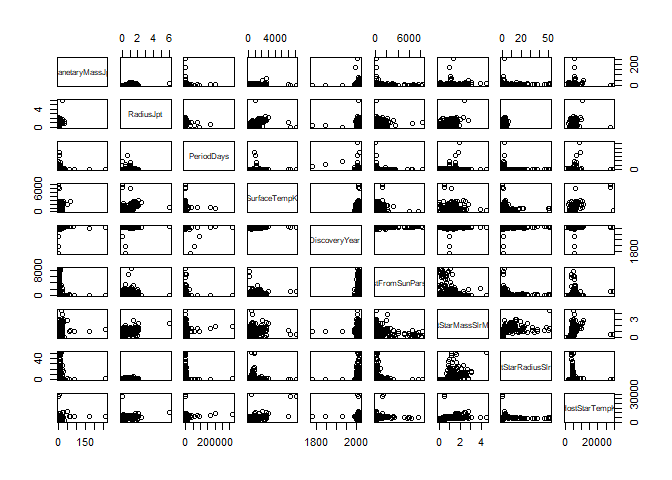 Basic Scatterplot Matrix between the given variables.

------------------------------------------------------------------------

Now let's begin with in-depth analysis of these variables.

------------------------------------------------------------------------

### TypeFlag

``` r
summary(exos$TypeFlag)
```

    ##    Min. 1st Qu.  Median    Mean 3rd Qu.    Max. 
    ## 0.00000 0.00000 0.00000 0.09766 0.00000 3.00000

First of all we see that the variable TypeFlag has only 4 values; 0, 1, 2, 3. We can rename the observations accordingly.

``` r
exos$TypeFlag <- ifelse(exos$TypeFlag==0,'no known stellar binary companion',exos$TypeFlag)
exos$TypeFlag <- ifelse(exos$TypeFlag==1,'P-type binary (circumbinary)',exos$TypeFlag)
exos$TypeFlag <- ifelse(exos$TypeFlag==2,'S-type binary',exos$TypeFlag)
exos$TypeFlag <- ifelse(exos$TypeFlag==3,'orphan planet (no star)',exos$TypeFlag)
```

``` r
summary(exos$TypeFlag)
```

    ##    Length     Class      Mode 
    ##      3584 character character

Now we can see number of observations in TypeFlag using table()

``` r
levels(as.factor(exos$TypeFlag)) # looking at levels as factors.
```

    ## [1] "no known stellar binary companion" "orphan planet (no star)"          
    ## [3] "P-type binary (circumbinary)"      "S-type binary"

``` r
table(exos$TypeFlag)
```

    ## 
    ## no known stellar binary companion           orphan planet (no star) 
    ##                              3396                                 3 
    ##      P-type binary (circumbinary)                     S-type binary 
    ##                                29                               156

------------------------------------------------------------------------

#### Converting variable Probability\_of\_life to factor

``` r
exos$Probability_of_life <- as.factor(exos$Probability_of_life)
table(exos$Probability_of_life)
```

    ## 
    ##    0    1 
    ## 3256  328

``` r
# So we have 328 planets in our dataset with some probability of life.
# 0  means No Life, 1 means Life
```

------------------------------------------------------------------------

#### Create a normalization function

``` r
# we can normalize the data 

#normalize_risk_h_numerical <- sapply(risk_h_numerical, function(x) {
#(x - min(x))/(max(x) - min(x))})

normalize <- function(x) {
return((x - min(x))/(max(x) - min(x)))} # create normalize function
```

#### Create a function to remove outliers

``` r
remove_outliers <- function(x, rm_NA = TRUE)
{
  qnt <- quantile(x, probs=c(.25, .75), na.rm = rm_NA)
  H <- 1.5 * IQR(x, na.rm = rm_NA)
  y <- x
  y[x < (qnt[1] - H)] <- NA
  y[x > (qnt[2] + H)] <- NA
  y
}
```

We will call this function later, this will shorten the code.

------------------------------------------------------------------------

### PlanetaryMassJpt

``` r
summary(exos$PlanetaryMassJpt)
```

    ##    Min. 1st Qu.  Median    Mean 3rd Qu.    Max.    NA's 
    ##   0.000   0.150   0.940   2.891   2.500 263.000    2271

``` r
summary(remove_outliers(exos$PlanetaryMassJpt))
```

    ##    Min. 1st Qu.  Median    Mean 3rd Qu.    Max.    NA's 
    ##   0.000   0.084   0.730   1.198   1.800   6.000    2424

``` r
massjptplot <- data.frame(remove_outliers(exos$PlanetaryMassJpt)) # Called the function to remove outliers.
ggplot(data=exos, aes(massjptplot)) + geom_histogram(breaks=seq(0, 10, by=.01), 
                 col="red", 
                 fill="green", 
                 alpha = .2) + 
  labs(title="Histogram for Mass of Planet") +
  labs(x="Mass of Planet(Jupiter = 1)", y="Count") + 
  xlim(c(0,10)) + 
  ylim(c(0,50)) +
  geom_vline(xintercept = 1, linetype = "dashed") +
  annotate("text", label="Jupiter", colour="black", x= 1.5, y = 49) +
  geom_vline(xintercept = 0.0031457007, linetype = "dashed") +
  annotate("text", label="Earth", colour="black", x= 0.1, y = 49)
```

    ## Warning: Removed 2424 rows containing non-finite values (stat_bin).

    ## Warning: Removed 3 rows containing missing values (geom_bar).

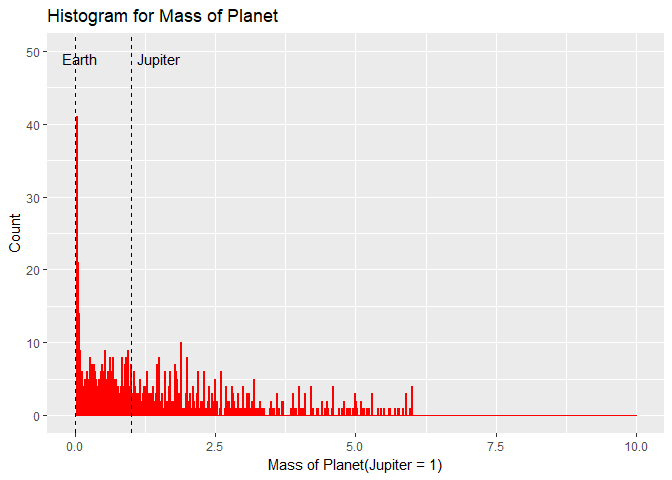

``` r
#boxplot(massjptplot, exos, horizontal = TRUE, axes = TRUE, range = 1,  col = c("red"), xlab = "Planetary Mass(Jupiter Mass)", 
#        ylab = "count", ylim = c(0, 8), las = 2)

ggplot(exos, aes(1, massjptplot)) +
      geom_boxplot(col = "red") +
  ggtitle("Boxplot of Planetary Mass(Jupiter Mass)") +
  coord_flip()
```

    ## Don't know how to automatically pick scale for object of type data.frame. Defaulting to continuous.

    ## Warning: Removed 2424 rows containing non-finite values (stat_boxplot).

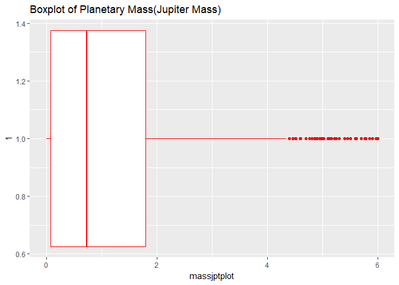 The plot of the mass with the outliers was not very useful. But the main bulk of the planets is within the much smaller range, so removed the outliers. There are still many extremely massive planets . But still, the largest bin is around Earth’s mass.

------------------------------------------------------------------------

### RadiusJpt

``` r
summary(exos$RadiusJpt)
```

    ##    Min. 1st Qu.  Median    Mean 3rd Qu.    Max.    NA's 
    ##  0.0023  0.1411  0.2096  0.3712  0.3215  6.0000     810

``` r
ggplot(data=exos, aes(exos$RadiusJpt)) + geom_histogram(aes(colour = Probability_of_life),breaks=seq(0, 5, by=.01), 
                 #col="red", 
                 #fill="green", 
                 alpha = .2) + 
  labs(title="Histogram for Radius of Planet") +
  labs(x="Radius of Planet(Jupiter = 1)", y="Count") + 
  xlim(c(0,5)) + 
  ylim(c(0,50)) +
  geom_vline(xintercept = 1, linetype = "dashed") +
  annotate("text", label="Jupiter", colour="black", x= 1.5, y = 49) +
  geom_vline(xintercept = 0.091130294, linetype = "dashed") +
  annotate("text", label="Earth", colour="black", x= 0.1, y = 49)
```

    ## Warning: Removed 811 rows containing non-finite values (stat_bin).

    ## Warning: Removed 19 rows containing missing values (geom_bar).

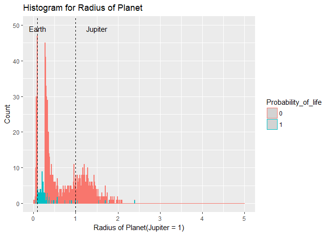

``` r
# boxplot(exos$RadiusJpt,horizontal=TRUE,axes=TRUE,range = 1, col = c("red"), xlab = "Boxplot for Radius of Planet")

ggplot(exos, aes(1, RadiusJpt)) +
      geom_boxplot(col = "red") +
  ggtitle("Boxplot of Radius of Planet") +
  coord_flip()
```

    ## Warning: Removed 810 rows containing non-finite values (stat_boxplot).

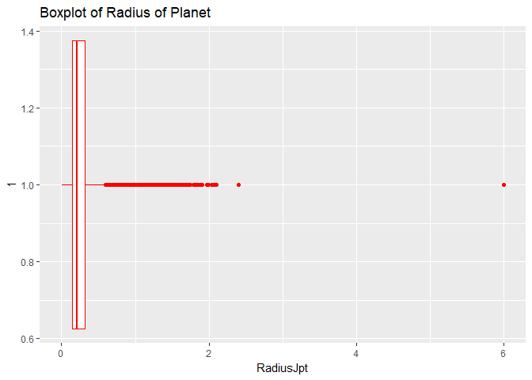

Shape is bimodal. The modes are aroud Earth’s size and Jupiter’s size. Hence maximum planets lies in these sizes(can't say for sure), as there might be some physical law that dictates that planets will tend to form around these two sizes. Also chance of Life = 1 bins are around Earth radius.

------------------------------------------------------------------------

### PeriodDays

``` r
summary(exos$PeriodDays)
```

    ##     Min.  1st Qu.   Median     Mean  3rd Qu.     Max.     NA's 
    ##      0.1      4.8     13.1    537.2     49.5 320000.0       99

We see that a planet takes 320000 days to complete one rotation around it's parent star. They can be termed as outliers.

Let's look at the plots.

``` r
#periodplot <- data.frame(remove_outliers(exos$PeriodDays))
ggplot(data=exos, aes(exos$PeriodDays)) + geom_histogram(aes(colour = Probability_of_life),breaks=seq(0, 5000, by=2), 
                 #col="red", 
                 #fill="green", 
                 alpha = .2) + 
  labs(title="Histogram for Period of Rotation of Planet") +
  labs(x="Rotation Days of Planet", y="Count") + 
  xlim(c(0,5000)) + 
  ylim(c(0,10)) +
  geom_vline(xintercept = 4332.82, linetype = "dashed") +
  annotate("text", label="Jupiter", colour="black", x= 4334, y = 9) +
  geom_vline(xintercept = 365.2422, linetype = "dashed") +
  annotate("text", label="Earth", colour="black", x= 366, y = 9)
```

    ## Warning: Removed 134 rows containing non-finite values (stat_bin).

    ## Warning: Removed 33 rows containing missing values (geom_bar).

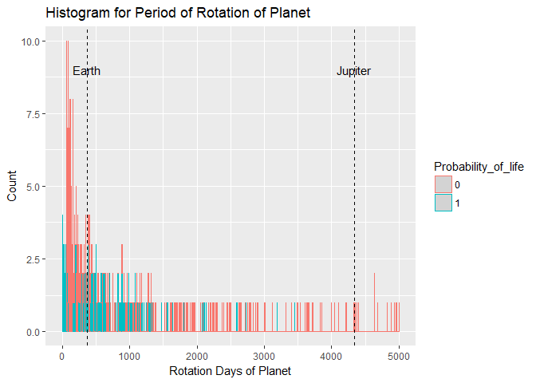

``` r
boxplot(exos$PeriodDays, horizontal=TRUE, axes=TRUE,range = 537.2, col = c("red"))
```

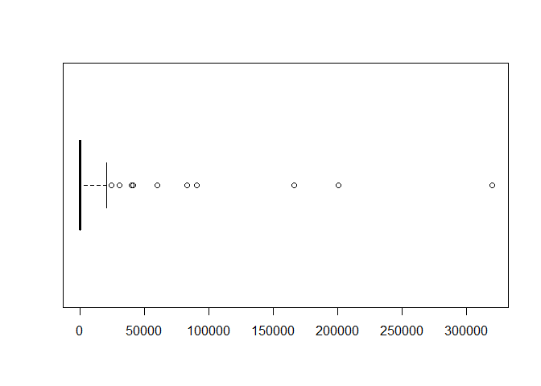

``` r
#ggplot(exos, aes(1, PeriodDays)) +
 #     geom_boxplot(col = "red") +
  #ggtitle("Boxplot of Period of Rotation of Planet)") +
   #coord_flip()
```

Most of the planets have less roation cycle as they tend to be close to their star. Our telescopes are still in infancy to locate planets with more number of rotation.

Also most planets with Life probability take less time rotating around their star, it's true, as most planets were found close to dwarf stars, also habitable zone is always nearby a parent star.

------------------------------------------------------------------------

SurfaceTempK
------------

``` r
summary(exos$SurfaceTempK)
```

    ##    Min. 1st Qu.  Median    Mean 3rd Qu.    Max.    NA's 
    ##   102.2   321.8   719.6   871.7  1310.9  7112.0    2843

``` r
ggplot(data=exos, aes(exos$SurfaceTempK)) + geom_histogram(aes(colour = Probability_of_life), breaks=seq(0, 8000, by=2.5), 
                 #col="red", 
                 #fill="green", 
                 alpha = .2) + 
  labs(title="Histogram for Surface Temperature Planet") +
  labs(x="Surface Temperature", y="Count") + 
  xlim(c(0,8000)) + 
  ylim(c(0,10)) +
  geom_vline(xintercept = 128.15, linetype = "dashed") +
  annotate("text", label="Jupiter", colour="black", x= 50, y = 10) +
  geom_vline(xintercept = 287, linetype = "dashed") +
  annotate("text", label="Earth", colour="black", x= 600, y = 10)
```

    ## Warning: Removed 2843 rows containing non-finite values (stat_bin).

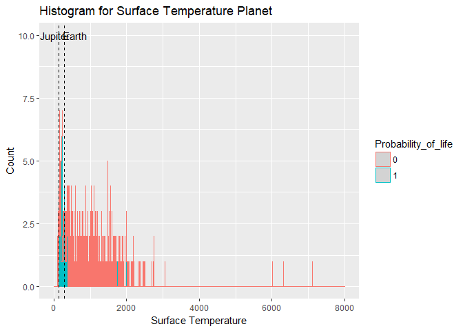

``` r
#hist(exos$SurfaceTempK, 1000)

#boxplot(exos$SurfaceTempK, horizontal=TRUE, axes=TRUE,range = 1, col = c("red"))

ggplot(exos, aes(1, SurfaceTempK)) +
      geom_boxplot(col = "red") +
  ggtitle("Boxplot for Surface Temperature Planet") +
  coord_flip()
```

    ## Warning: Removed 2843 rows containing non-finite values (stat_boxplot).

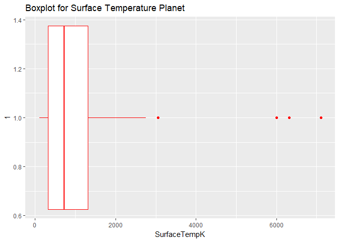

More planets observed have much hotter surface temperatures. We can say that they are much closer to their host star. They cannot be mostly habitable.

Also most planets with Life probability have close to Earth's surface temperature.

------------------------------------------------------------------------

### DiscoveryMethod

``` r
levels(as.factor(exos$DiscoveryMethod))
```

    ## [1] ""             "imaging"      "microlensing" "RV"          
    ## [5] "timing"       "transit"

``` r
exos %>% group_by(DiscoveryMethod) %>% summarise(number_discovered=n())
```

    ## # A tibble: 6 x 2
    ##   DiscoveryMethod number_discovered
    ##            <fctr>             <int>
    ## 1                                63
    ## 2         imaging                52
    ## 3    microlensing                40
    ## 4              RV               692
    ## 5          timing                25
    ## 6         transit              2712

More planets were observed using transit method, as our telescpoes(mainly Kepler) are better at observing the dip in brightness.

``` r
exos$DiscoveryMethod[exos$DiscoveryMethod == '']  <- NA
methodplot <- exos[!is.na(exos$DiscoveryMethod),]

library(scales)

ggplot(methodplot,aes(x = DiscoveryYear, fill = DiscoveryMethod)) +
  geom_line(stat = "bin", binwidth = 2, aes(colour = DiscoveryMethod)) +
  scale_x_continuous(breaks = pretty_breaks(n = 10)) +
  coord_cartesian(xlim =c(1992, 2016)) +
  xlab("Year") + ylab("Planets Discovered") +
  theme(panel.background = element_rect(fill = "white",
        color = "black", size = 0.1),
        axis.text.x = element_text(angle = 45, hjust = 1))
```

    ## Warning: Removed 3 rows containing non-finite values (stat_bin).

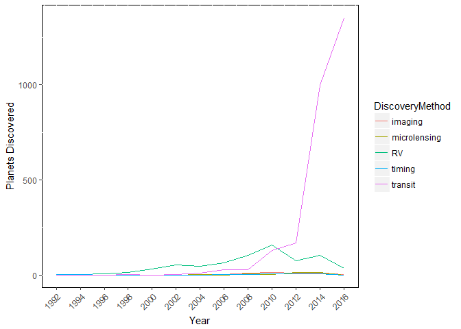

Looks like by using RV and transit we found most amount of planets.

------------------------------------------------------------------------

### DiscoveryYear

``` r
summary(exos$DiscoveryYear)
```

    ##    Min. 1st Qu.  Median    Mean 3rd Qu.    Max.    NA's 
    ##    1781    2013    2014    2013    2016    2017      10

``` r
ggplot(data=exos, aes(exos$DiscoveryYear)) + geom_histogram(aes(colour = Probability_of_life),breaks=seq(1781, 2017, by=2), 
                 #col="red", 
                 #fill="red", 
                 alpha = .2) + 
  labs(title="Histogram for Discovery Year of Planet") +
  labs(x="Year", y="Count") + 
  xlim(c(1781,2017)) + 
  ylim(c(0,1500))
```

    ## Warning: Removed 10 rows containing non-finite values (stat_bin).

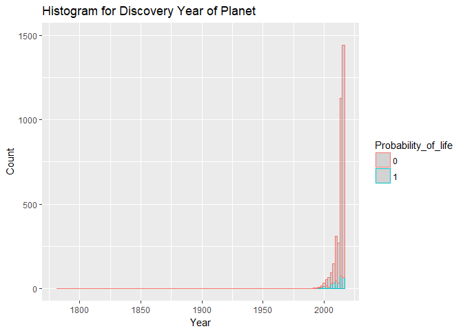

``` r
# hist(exos$DiscoveryYear, 1000)
# boxplot(exos$DiscoveryYear, horizontal=TRUE, axes=TRUE,range = 10, col = "red")
```

After the launch of Kepler Space Telescope and after 2013( when Kepler’s second reaction wheel failed and that the mission had to be replanned) we observed more planets.

Also planets with Life probability were mostly discovered recently due to the advancements in telescopes.

------------------------------------------------------------------------

#### Distribution of Jupiter Masses of these planets?

``` r
massjptplot_1 <- remove_outliers(exos$PlanetaryMassJpt)
ggplot(exos, aes(TypeFlag, massjptplot_1)) +
        geom_boxplot(colour = "red") +
  ggtitle("Boxplot of Mass of Planet vs TypeFlag") +
  coord_flip()
```

    ## Warning: Removed 2424 rows containing non-finite values (stat_boxplot).

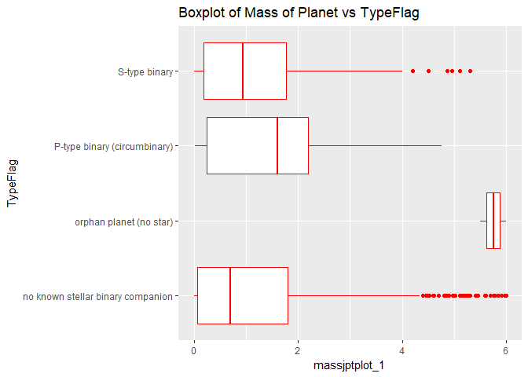

``` r
# varwidth = FALSE, size = 4, colour = "red")  + 
#  scale_x_discrete(name = "Planetary Mass(Jupiter Mass)", breaks = seq(0, 6, 2),limits=c(0, 6)

ggplot(exos, aes(TypeFlag, massjptplot_1)) +
        geom_point(aes(colour = DiscoveryMethod)) +
  ggtitle("Mass of Planet vs TypeFlag") +
  coord_flip()
```

    ## Warning: Removed 2424 rows containing missing values (geom_point).

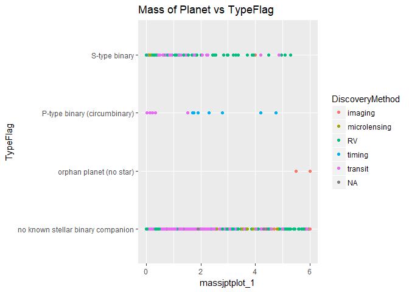

So we can see that our star is an odd compared to others, as most star have a stellar companion.

Planets with higher mass are easily spotted by Transit method.

Massive planets are less which are found orbitting P-type binary(both stars) which is true as more massive the planet, more chace it has to destablize the system, or collide with parent star.

Most of the planets are observed by transit Method.

------------------------------------------------------------------------

#### Discovery methods by Temperature

``` r
ggplot(exos, aes(exos$DiscoveryMethod, exos$SurfaceTempK)) +
      geom_boxplot(col = "red") +
  ggtitle("Boxplot of Planet Temp vs Discovery Method") +
  coord_flip()
```

    ## Warning: Removed 2843 rows containing non-finite values (stat_boxplot).

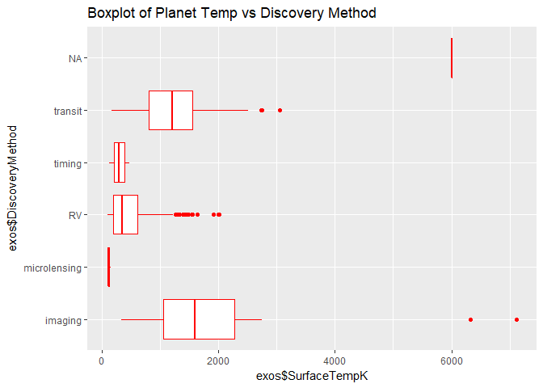

``` r
# size = 4, colour = "red")                               +
# scale_x_discrete(name = "Surface Temperature", breaks = seq(0, 6000, 2),limits=c(0, 6000)        

ggplot(exos, aes(exos$DiscoveryMethod, exos$SurfaceTempK)) +
      geom_point(aes(colour = Probability_of_life)) +
  ggtitle("Planet Temp vs Discovery Method") +
  coord_flip()
```

    ## Warning: Removed 2843 rows containing missing values (geom_point).

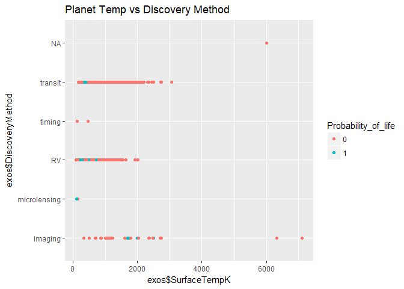

We see that hotter planets were discovered by the imaging method. Microlensing was used for colder planets.

------------------------------------------------------------------------

#### Relationship between SemiMajor Axis and Period

``` r
axpdplot <- select(exos,c(SemiMajorAxisAU,PeriodDays))
axpdplot <- na.omit(axpdplot)
ggplot(axpdplot, aes(x=log(SemiMajorAxisAU), y=log(PeriodDays))) +
  geom_point(col = "red") +
  stat_smooth(method=lm, level=0.95, col = "black") # log to make plot more readable.
```

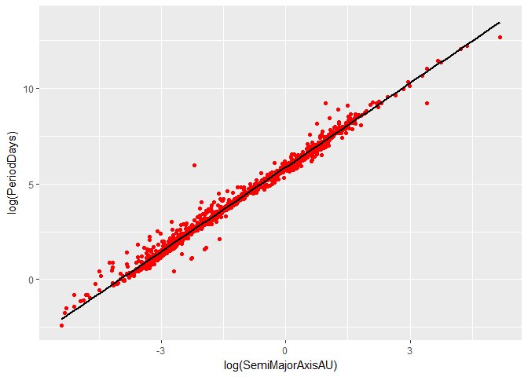 The relationship is linear. We can predict the Period of a planet from the length of its semi-major axis.

------------------------------------------------------------------------

#### Star

------------------------------------------------------------------------

##### Relationship between star mass and star temperature

``` r
mastemplot1 <- select(exos,c(HostStarMassSlrMass,HostStarTempK,Probability_of_life))
mastemplot1 <- na.omit(mastemplot1)
ggplot(mastemplot1,aes(x = log(HostStarMassSlrMass),y = log(HostStarTempK))) + 
  geom_point(aes(colour = Probability_of_life)) +  # log transformation to get readable plot.
  stat_smooth(method = lm, col="black") +
  geom_vline(xintercept = 0.00000001, linetype = "dashed") +
  annotate("text", label="Sun(Sol)", colour="black", x= 0, y = 10)
```

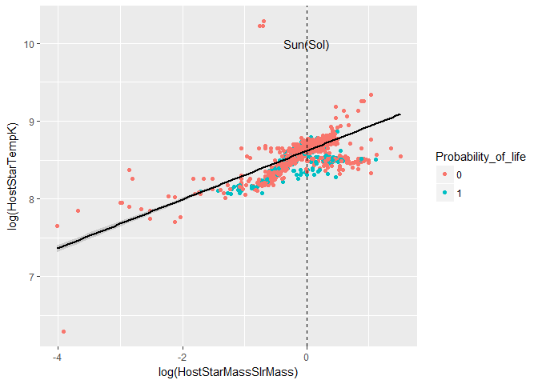

As the mass of the star increases, the temperature of the star also increases.

Also most of the Life probability is around our Sun mass stars.

------------------------------------------------------------------------

##### Relationship between Planet Mass and Host Star Mass

``` r
#create a scatter plot
ggplot(data = exos, aes(x = HostStarMassSlrMass, y = PlanetaryMassJpt)) +
  geom_point(aes(colour = Probability_of_life)) +
  scale_y_continuous("PlanetaryMassJpt", breaks = seq(0,270,10)) +
  geom_vline(xintercept = 1, linetype = "dashed") +
  annotate("text", label="Sun(Sol)", colour="black", x= 1, y = 260) +
  geom_hline(yintercept = 0.003145701, linetype = "dashed") +
  annotate("text", label="Earth", colour="black", x= 4, y = 4)
```

    ## Warning: Removed 2343 rows containing missing values (geom_point).

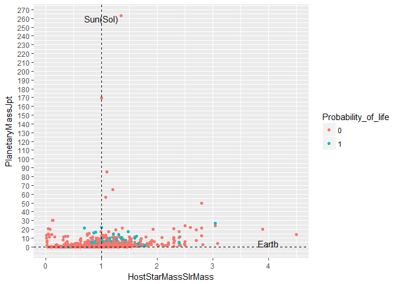

we see that most of the planets with some probabolity of life are somewhat massive than Earth

This is because our telescope technology is not that strong

Also most of them lie between 0.5 to 2 times our Sun mass

At the cross-section of Sun and Earth most planets with Life probability lie.

------------------------------------------------------------------------

### Location and Discovery

#### Distance From Us

``` r
summary(exos$DistFromSunParsec)
```

    ##     Min.  1st Qu.   Median     Mean  3rd Qu.     Max.     NA's 
    ##    1.295   60.000  333.000  554.912  773.130 8500.000     1451

``` r
ggplot(data=exos, aes(exos$DistFromSunParsec)) + 
  geom_histogram(aes(colour = Probability_of_life), breaks=seq(0, 9000, by = 8), 
                 #col="red", 
                 #fill="red", 
                 alpha = .2) + 
  labs(title="Histogram for Discovery Year of Planet") +
  labs(x="Distance(Parsec)", y="Count") + 
  xlim(c(0,9000)) + 
  ylim(c(0,30))
```

    ## Warning: Removed 1451 rows containing non-finite values (stat_bin).

    ## Warning: Removed 10 rows containing missing values (geom_bar).

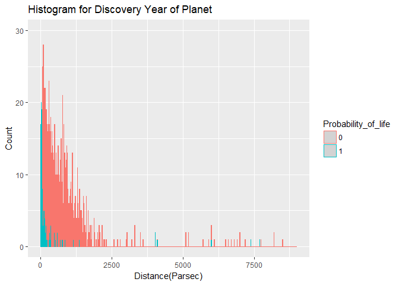

So we discover more planets closer to us as our technology is still in infancy.

And obviously our models and telescopes can predict Life closer to us.

------------------------------------------------------------------------

------------------------------------------------------------------------

------------------------------------------------------------------------

------------------------------------------------------------------------

### Classification

After the exploratory analysis, where we have observed the relation between attributes, our task is now to make a Model which can classify a Planet with Life(1) or No Life(0). For this we first have to fill all the missing data, as most of the models we are working with don't work well or at all with missing values. We could not remove the missing columns as they were unevenly distributed across whole dataset. We have used Package Amelia for filling out the missing values. As our model will need supervised learning machine algorithm, we are using seven of them here.

KNN Model - When we need classification for a new data, the KNN algorithm goes through the entire dataset to find the k-nearest values to the new data values, or the k number of values most similar to the new record, and then outputs the mode (most frequent class) for a classification problem. The value of k is specified by user.

Decision Tree Model - it is a type of supervised learning algorithm (having a pre-defined target variable). It works for both categorical and continuous input and output variables. Here we split the population or sample into two or more homogeneous set based on most significant splitter / differentiator in input variables.

Random Forest Model - Random Forest (multiple learners) is an improvement over bagged decision trees (a single learner). It can handle large data set with higher dimensionality. It can handle thousands of input variables and identify most significant variables so it is considered as one of the dimensionality reduction methods.

Naive Bayes - To calculate the probability that an event will occur, given that another event has already occurred, we use Bayes’ Theorem. To calculate the probability of an outcome given the value of some variable. Naive Bayes can handle missing data. ‘naive’ because it assumes that all the variables are independent of each other. This should not work very well with our model. But let's look at it too.

Logistic Regression Model - Logistic regression predictions are discrete values(Life or no Life). ITthe output is in the form of probabilities of the default class. As it is a probability, the output lies in the range of 0-1. The output y-value is generated by log transforming the x-value. Then we force this probability into a binary classification.

GBM Model - A boosting algorithm.It is a machine learning technique for regression and classification problems.It produces a prediction model in the form of an ensemble of weak prediction models, typically decision trees.

Extreme Gradient Boosting, XGBoost Model - It does parallel computation on a single machine. This makes xgboost at least 10 times faster than existing gradient boosting implementations. It supports various objective functions, including regression, classification and ranking. It only works with numeric vectors.

``` r
# using missing data imputation 'Amelia' package for filling the missing values in our dataset.
#library('Rcpp')
#library('Amelia')
#AmeliaView()
```

``` r
# load the new dataset
exosim <- read.csv(file.choose(), header = TRUE) # load exos_new-imp2.csv
```

``` r
summary(exosim)
```

    ##      PlanetIdentifier    TypeFlag       PlanetaryMassJpt  
    ##  Kepler-953 b:   2    Min.   :0.00000   Min.   :-31.8431  
    ##  Kepler-953 c:   2    1st Qu.:0.00000   1st Qu.: -0.5866  
    ##  11 Com b    :   1    Median :0.00000   Median :  1.2200  
    ##  11 UMi b    :   1    Mean   :0.09766   Mean   :  2.6056  
    ##  14 And b    :   1    3rd Qu.:0.00000   3rd Qu.:  6.5000  
    ##  14 Her b    :   1    Max.   :3.00000   Max.   :263.0000  
    ##  (Other)     :3576                                        
    ##    RadiusJpt         PeriodDays       SemiMajorAxisAU   
    ##  Min.   :-3.4603   Min.   :-18307.6   Min.   :-53.9517  
    ##  1st Qu.: 0.1423   1st Qu.:     4.6   1st Qu.: -3.8253  
    ##  Median : 0.2287   Median :    13.2   Median :  0.1897  
    ##  Mean   : 0.4437   Mean   :   566.0   Mean   :  1.0613  
    ##  3rd Qu.: 0.5605   3rd Qu.:    52.6   3rd Qu.:  5.3217  
    ##  Max.   : 7.6803   Max.   :320000.0   Max.   :662.0000  
    ##                                                         
    ##   Eccentricity      PeriastronDeg     LongitudeDeg     AscendingNodeDeg 
    ##  Min.   :-0.60038   Min.   :-390.5   Min.   :-1080.0   Min.   :-973.22  
    ##  1st Qu.: 0.01112   1st Qu.:  52.2   1st Qu.:  138.7   1st Qu.:  34.47  
    ##  Median : 0.14000   Median : 133.0   Median :  212.8   Median : 102.37  
    ##  Mean   : 0.16253   Mean   : 132.0   Mean   :  216.6   Mean   :  98.32  
    ##  3rd Qu.: 0.29084   3rd Qu.: 211.3   3rd Qu.:  287.3   3rd Qu.: 169.39  
    ##  Max.   : 5.54381   Max.   : 791.0   Max.   : 1326.0   Max.   : 825.73  
    ##                                                                         
    ##  InclinationDeg    SurfaceTempK         AgeGyr            DiscoveryMethod
    ##  Min.   :-28.52   Min.   :-4720.5   Min.   :-1.4002               :  63  
    ##  1st Qu.: 69.57   1st Qu.:  381.5   1st Qu.: 0.9342   imaging     :  52  
    ##  Median : 84.89   Median :  733.9   Median : 1.5300   microlensing:  40  
    ##  Mean   : 82.34   Mean   :  769.0   Mean   : 1.5390   RV          : 692  
    ##  3rd Qu.: 92.33   3rd Qu.: 1101.4   3rd Qu.: 2.1283   timing      :  25  
    ##  Max.   :305.00   Max.   : 7112.0   Max.   : 4.9689   transit     :2712  
    ##                                                                          
    ##  DiscoveryYear     LastUpdated    RightAscension       Declination  
    ##  Min.   :1781   16/05/10 :1283           :  10               :  10  
    ##  1st Qu.:2013   14/02/26 : 726   01 37 54:   9   -60 30 42   :   9  
    ##  Median :2014   11/9/2012:  38   17 18 57:   7   -34 59 23   :   8  
    ##  Mean   :2013   14/02/24 :  34   18 57 44:   7   -05 02 36.44:   7  
    ##  3rd Qu.:2016   15/12/03 :  25   19 16 18:   7   +38 20 37   :   7  
    ##  Max.   :2028   15/12/06 :  24   19 19 26:   7   +49 18 19   :   7  
    ##                 (Other)  :1454   (Other) :3537   (Other)     :3536  
    ##  DistFromSunParsec  HostStarMassSlrMass HostStarRadiusSlrRad
    ##  Min.   :-5123.29   Min.   :0.0120      Min.   :-7.877      
    ##  1st Qu.:   89.95   1st Qu.:0.8300      1st Qu.: 0.800      
    ##  Median :  482.88   Median :0.9770      Median : 1.000      
    ##  Mean   :  665.76   Mean   :0.9838      Mean   : 1.500      
    ##  3rd Qu.: 1025.72   3rd Qu.:1.1100      3rd Qu.: 1.290      
    ##  Max.   :16594.87   Max.   :4.5000      Max.   :51.100      
    ##                                                             
    ##  HostStarMetallicity HostStarTempK   HostStarAgeGyr   
    ##  Min.   :-2.09000    Min.   :  540   Min.   :-23.598  
    ##  1st Qu.:-0.07000    1st Qu.: 5106   1st Qu.:  1.794  
    ##  Median : 0.02000    Median : 5636   Median :  4.653  
    ##  Mean   : 0.01177    Mean   : 5520   Mean   :  4.838  
    ##  3rd Qu.: 0.11000    3rd Qu.: 5944   3rd Qu.:  7.826  
    ##  Max.   : 0.56000    Max.   :29300   Max.   : 80.000  
    ##                                                       
    ##                                              ListsPlanetIsOn
    ##  Confirmed planets                                   :3295  
    ##  Confirmed planets, Planets in binary systems, S-type: 135  
    ##  Controversial                                       :  72  
    ##  Confirmed planets, Planets in binary systems, P-type:  21  
    ##  Controversial, Planets in binary systems, S-type    :  20  
    ##  Confirmed planets, Planets in open clusters         :  13  
    ##  (Other)                                             :  28  
    ##  Probability_of_life
    ##  Min.   :0.00000    
    ##  1st Qu.:0.00000    
    ##  Median :0.00000    
    ##  Mean   :0.09152    
    ##  3rd Qu.:0.00000    
    ##  Max.   :1.00000    
    ## 

So we have removed all the missing values.

#### KNN

``` r
exosim_numerical <- subset(exosim, select = c(PlanetaryMassJpt, RadiusJpt, PeriodDays, SemiMajorAxisAU, Eccentricity, PeriastronDeg, LongitudeDeg, AscendingNodeDeg, InclinationDeg, SurfaceTempK, AgeGyr, DiscoveryYear, DistFromSunParsec, HostStarMassSlrMass, HostStarRadiusSlrRad, HostStarMetallicity, HostStarTempK, HostStarAgeGyr))
```

``` r
#install.packages("corrr")
library(corrr)
```

    ## Warning: package 'corrr' was built under R version 3.4.3

``` r
exosim_numerical %>% correlate() %>% rplot()
```

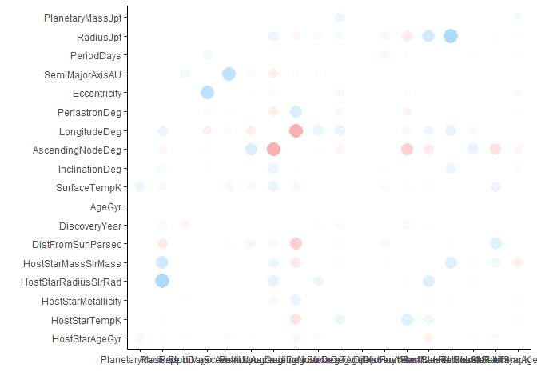

We see very less correlation between the variables, so we don't have to remove any.

``` r
#### Converting variable Probability_of_life to factor
exosim$Probability_of_life <- as.factor(exosim$Probability_of_life)
table(exosim$Probability_of_life)
```

    ## 
    ##    0    1 
    ## 3256  328

``` r
# So we have 328 planets in our dataset with some probability of life.
```

``` r
label_1 <- exosim$Probability_of_life # our variable for classification
```

``` r
# Categorical variables need to be represented with numbers 
TypeFlag_dummies <- model.matrix( ~ TypeFlag - 1, data = exosim)

DiscoveryMethod_dummies <- model.matrix( ~ DiscoveryMethod - 1, data = exosim)

ListsPlanetIsOn_dummies <- model.matrix( ~ ListsPlanetIsOn - 1, data = exosim)
```

``` r
exosim_numcat <- data.frame(exosim_numerical, TypeFlag_dummies, DiscoveryMethod_dummies, ListsPlanetIsOn_dummies)
```

``` r
str(exosim_numcat)
```

    ## 'data.frame':    3584 obs. of  38 variables:
    ##  $ PlanetaryMassJpt                                                                                 : num  19.4 11.2 4.8 4.97 7.68 ...
    ##  $ RadiusJpt                                                                                        : num  3.18 3.117 2.063 0.538 0.334 ...
    ##  $ PeriodDays                                                                                       : num  326 516 186 1766 9886 ...
    ##  $ SemiMajorAxisAU                                                                                  : num  1.29 1.54 0.83 2.86 9.04 ...
    ##  $ Eccentricity                                                                                     : num  0.231 0.08 0 0.359 0.184 ...
    ##  $ PeriastronDeg                                                                                    : num  94.8 117.6 0 22.2 189.1 ...
    ##  $ LongitudeDeg                                                                                     : num  412 433 573 226 124 ...
    ##  $ AscendingNodeDeg                                                                                 : num  -84.2 237.1 -95.4 106.9 332.1 ...
    ##  $ InclinationDeg                                                                                   : num  115.9 114.3 91.8 78.1 36.1 ...
    ##  $ SurfaceTempK                                                                                     : num  -194 315 1049 490 985 ...
    ##  $ AgeGyr                                                                                           : num  1.223 1.963 2.052 -0.418 -0.169 ...
    ##  $ DiscoveryYear                                                                                    : num  2008 2009 2008 2002 2006 ...
    ##  $ DistFromSunParsec                                                                                : num  88.9 122.1 79.2 18.1 18.1 ...
    ##  $ HostStarMassSlrMass                                                                              : num  2.7 1.8 2.2 1 1 ...
    ##  $ HostStarRadiusSlrRad                                                                             : num  19 24.08 11 0.708 0.708 ...
    ##  $ HostStarMetallicity                                                                              : num  -0.35 0.04 -0.24 0.43 0.43 ...
    ##  $ HostStarTempK                                                                                    : num  4742 4340 4813 5311 5311 ...
    ##  $ HostStarAgeGyr                                                                                   : num  5.246 1.312 -2.181 9.272 -0.323 ...
    ##  $ TypeFlag                                                                                         : num  0 0 0 0 0 2 0 0 0 0 ...
    ##  $ DiscoveryMethod                                                                                  : num  0 0 0 0 0 0 0 0 0 0 ...
    ##  $ DiscoveryMethodimaging                                                                           : num  0 0 0 0 0 0 0 1 0 0 ...
    ##  $ DiscoveryMethodmicrolensing                                                                      : num  0 0 0 0 0 0 0 0 0 0 ...
    ##  $ DiscoveryMethodRV                                                                                : num  1 1 1 1 1 1 1 0 0 1 ...
    ##  $ DiscoveryMethodtiming                                                                            : num  0 0 0 0 0 0 0 0 0 0 ...
    ##  $ DiscoveryMethodtransit                                                                           : num  0 0 0 0 0 0 0 0 1 0 ...
    ##  $ ListsPlanetIsOnConfirmed.planets                                                                 : num  1 1 1 1 0 0 1 1 0 1 ...
    ##  $ ListsPlanetIsOnConfirmed.planets..Orphan.planets                                                 : num  0 0 0 0 0 0 0 0 0 0 ...
    ##  $ ListsPlanetIsOnConfirmed.planets..Planets.in.binary.systems..P.type                              : num  0 0 0 0 0 0 0 0 0 0 ...
    ##  $ ListsPlanetIsOnConfirmed.planets..Planets.in.binary.systems..P.type..Planets.in.globular.clusters: num  0 0 0 0 0 0 0 0 0 0 ...
    ##  $ ListsPlanetIsOnConfirmed.planets..Planets.in.binary.systems..S.type                              : num  0 0 0 0 0 1 0 0 0 0 ...
    ##  $ ListsPlanetIsOnConfirmed.planets..Planets.in.open.clusters                                       : num  0 0 0 0 0 0 0 0 0 0 ...
    ##  $ ListsPlanetIsOnControversial                                                                     : num  0 0 0 0 1 0 0 0 1 0 ...
    ##  $ ListsPlanetIsOnControversial..Planets.in.binary.systems..P.type                                  : num  0 0 0 0 0 0 0 0 0 0 ...
    ##  $ ListsPlanetIsOnControversial..Planets.in.binary.systems..S.type                                  : num  0 0 0 0 0 0 0 0 0 0 ...
    ##  $ ListsPlanetIsOnKepler.Objects.of.Interest                                                        : num  0 0 0 0 0 0 0 0 0 0 ...
    ##  $ ListsPlanetIsOnPlanets.in.binary.systems..S.type..Confirmed.planets                              : num  0 0 0 0 0 0 0 0 0 0 ...
    ##  $ ListsPlanetIsOnRetracted.planet.candidate                                                        : num  0 0 0 0 0 0 0 0 0 0 ...
    ##  $ ListsPlanetIsOnSolar.System                                                                      : num  0 0 0 0 0 0 0 0 0 0 ...

``` r
# normalize 
norm_exosim_numcat <- as.data.frame(sapply(exosim_numcat, normalize))
```

``` r
set.seed(1234)
oneortwo <- sample(1:2 , length(exosim$PlanetIdentifier), replace = TRUE, prob=c(0.8, 0.2)) # generating random values and storing them
```

``` r
# create train data frame
train_1 <- norm_exosim_numcat[oneortwo == 1, ]

# create test data frame
test_1 <- norm_exosim_numcat[oneortwo == 2, ]

# create data frame to apply train and test upon
train_1_label <- label_1[oneortwo == 1]
test_1_label <- label_1[oneortwo == 2]
```

``` r
require(class)  # to use knn algorithm  
```

    ## Loading required package: class

``` r
# splitting the data
set.seed(1234)
life_predicted_1 <- knn(train = train_1, test = test_1, cl = train_1_label, k = 20)
```

``` r
results_1 <- data.frame(life_predicted_1, test_1_label)
#install.packages('caret')
require(caret)
```

    ## Loading required package: caret

    ## Loading required package: lattice

``` r
#install.packages('e1071')
require(e1071)
```

    ## Loading required package: e1071

    ## Warning: package 'e1071' was built under R version 3.4.3

``` r
accuracy_1 <- paste("Accuracy of KNN Model is:", sum(life_predicted_1 == test_1_label)/length(life_predicted_1))
knn <- sum(life_predicted_1 == test_1_label)/length(life_predicted_1)

confusionMatrix(table(results_1))
```

    ## Confusion Matrix and Statistics
    ## 
    ##                 test_1_label
    ## life_predicted_1   0   1
    ##                0 652  59
    ##                1   2   3
    ##                                           
    ##                Accuracy : 0.9148          
    ##                  95% CI : (0.8919, 0.9342)
    ##     No Information Rate : 0.9134          
    ##     P-Value [Acc > NIR] : 0.4808          
    ##                                           
    ##                   Kappa : 0.0776          
    ##  Mcnemar's Test P-Value : 7.496e-13       
    ##                                           
    ##             Sensitivity : 0.99694         
    ##             Specificity : 0.04839         
    ##          Pos Pred Value : 0.91702         
    ##          Neg Pred Value : 0.60000         
    ##              Prevalence : 0.91341         
    ##          Detection Rate : 0.91061         
    ##    Detection Prevalence : 0.99302         
    ##       Balanced Accuracy : 0.52266         
    ##                                           
    ##        'Positive' Class : 0               
    ## 

We get an accuracy of 91.48% which is really good, but has a room for improvemnet.

------------------------------------------------------------------------

#### Decision Trees

``` r
#install.packages('rattle')
#install.packages('rpart.plot')
#install.packages('RColorBrewer')

library(rpart) #rpart for “Recursive Partitioning and Regression Trees” and uses the CART decision tree algorithm.

# For better insights from rpart plot we import these libraries.
library(rattle)
```

    ## Rattle: A free graphical interface for data science with R.
    ## Version 5.1.0 Copyright (c) 2006-2017 Togaware Pty Ltd.
    ## Type 'rattle()' to shake, rattle, and roll your data.

``` r
library(rpart.plot)
library(RColorBrewer)
```

``` r
# create train data frame
train_2 <- exosim[oneortwo == 1, -26]

# create test data frame
test_2 <- exosim[oneortwo == 2, -26]

# create data frame to apply train and test upon
train_2_label <- label_1[oneortwo == 1]
test_2_label <- label_1[oneortwo == 2]
```

``` r
test_2 <- data.frame(test_2, test_2_label)
head(test_2)
```

    ##    PlanetIdentifier TypeFlag PlanetaryMassJpt RadiusJpt  PeriodDays
    ## 5          14 Her c        0           7.6790 0.3337576  9886.00000
    ## 14   2M 1938+4603 b        1           1.9000 0.5476978   416.00000
    ## 16     2M 2206-20 b        0          30.0000 1.3000000  8686.00000
    ## 26         47 UMa d        0           1.6400 0.5948477 14002.00000
    ## 28         51 Peg b        0           0.4600 0.8117291     4.23100
    ## 29         55 Cnc b        2           0.8306 0.8484087    14.65152
    ##    SemiMajorAxisAU Eccentricity PeriastronDeg LongitudeDeg
    ## 5        9.0370000   0.18400000      189.0760     123.7309
    ## 14       0.9200000   0.03529439      124.0494     312.6796
    ## 16       4.4800000   0.00000000      305.9815     125.5342
    ## 26      11.6000000   0.16000000      110.0000     182.2054
    ## 28       0.0520000   0.00000000        0.0000     394.4843
    ## 29       0.1152273   0.00340000       98.0000      61.4400
    ##    AscendingNodeDeg InclinationDeg SurfaceTempK     AgeGyr DiscoveryMethod
    ## 5         332.06693       36.07736    984.87040 -0.1690265              RV
    ## 14        -39.69173       60.46240   1110.16195  3.3509825          timing
    ## 16        247.45334       44.30000   1706.64862  1.0119986         imaging
    ## 26         79.37761       84.42846    944.97441  1.4881797              RV
    ## 28         70.90759       80.00000   1260.30000  1.7192846              RV
    ## 29        204.66873       44.67023    -12.30588  1.7173882              RV
    ##    DiscoveryYear LastUpdated RightAscension    Declination
    ## 5           2006    15/09/21       16 10 23      +43 49 18
    ## 14          2015    15/06/11     19 38 32.6      +46 03 59
    ## 16          2010   12/1/2020   22 06 22.802   -20 47 05.90
    ## 26          2010    15/09/24 10 59 27.97282 +40 25 48.9202
    ## 28          1995    15/05/24       22 57 27      +20 46 07
    ## 29          1996    15/01/26 08 52 35.81093 +28 19 50.9511
    ##    DistFromSunParsec HostStarMassSlrMass HostStarRadiusSlrRad
    ## 5             18.100           1.0000000             0.708000
    ## 14          1535.261           0.9336037             3.916356
    ## 16            26.670           0.1300000             0.110000
    ## 26            14.063           1.0630000             1.240000
    ## 28            14.700           1.0400000             1.266000
    ## 29            12.340           0.9600000             0.960000
    ##    HostStarMetallicity HostStarTempK HostStarAgeGyr
    ## 5            0.4300000      5311.000      -0.323214
    ## 14          -0.2082313      5902.389      12.656700
    ## 16          -0.1145526      2350.000      10.525851
    ## 26          -0.0190000      5818.700       6.480000
    ## 28           0.2000000      5793.000      -1.350030
    ## 29           0.3000000      5219.000       7.638143
    ##                                         ListsPlanetIsOn test_2_label
    ## 5                                         Controversial            0
    ## 14 Confirmed planets, Planets in binary systems, P-type            0
    ## 16                                    Confirmed planets            0
    ## 26                                    Confirmed planets            0
    ## 28                                    Confirmed planets            0
    ## 29 Confirmed planets, Planets in binary systems, S-type            0

``` r
train_2 <- data.frame(train_2, train_2_label)
head(train_2)
```

    ##   PlanetIdentifier TypeFlag PlanetaryMassJpt RadiusJpt PeriodDays
    ## 1         11 Com b        0           19.400 3.1797009     326.03
    ## 2         11 UMi b        0           11.200 3.1170968     516.22
    ## 3         14 And b        0            4.800 2.0633377     185.84
    ## 4         14 Her b        0            4.975 0.5384652    1766.00
    ## 6     16 Cygni B b        2            1.770 0.4955528     799.50
    ## 7         18 Del b        0           10.300 1.2788760     993.30
    ##   SemiMajorAxisAU Eccentricity PeriastronDeg LongitudeDeg AscendingNodeDeg
    ## 1           1.290        0.231         94.80     412.1695        -84.18270
    ## 2           1.540        0.080        117.63     433.2336        237.05636
    ## 3           0.830        0.000          0.00     573.4702        -95.38436
    ## 4           2.864        0.359         22.23     225.7752        106.85216
    ## 6           1.720        0.689         83.40     138.8458         12.08289
    ## 7           2.600        0.080        166.10     371.0341         44.06583
    ##   InclinationDeg SurfaceTempK     AgeGyr DiscoveryMethod DiscoveryYear
    ## 1      115.91938    -193.6209  1.2228196              RV          2008
    ## 2      114.26185     314.5210  1.9629923              RV          2009
    ## 3       91.81061    1049.3658  2.0520723              RV          2008
    ## 4       78.13019     490.0958 -0.4179759              RV          2002
    ## 6       45.00000    -673.7166  2.8587659              RV          1996
    ## 7       71.90324     273.7105  0.8739372              RV          2008
    ##   LastUpdated RightAscension    Declination DistFromSunParsec
    ## 1    15/09/20       12 20 43      +17 47 34            88.900
    ## 2    15/09/20 15 17 05.88899 +71 49 26.0466           122.100
    ## 3    15/09/20 23 31 17.41346 +39 14 10.3092            79.200
    ## 4    15/09/21       16 10 23      +43 49 18            18.100
    ## 6    15/09/22 19 41 48.95343 +50 31 30.2153            21.146
    ## 7    15/09/23 20 58 25.93397 +10 50 21.4289            75.300
    ##   HostStarMassSlrMass HostStarRadiusSlrRad HostStarMetallicity
    ## 1                2.70               19.000              -0.350
    ## 2                1.80               24.080               0.040
    ## 3                2.20               11.000              -0.240
    ## 4                1.00                0.708               0.430
    ## 6                1.07                1.127               0.052
    ## 7                2.30                8.500              -0.052
    ##   HostStarTempK HostStarAgeGyr
    ## 1          4742       5.246499
    ## 2          4340       1.311730
    ## 3          4813      -2.180942
    ## 4          5311       9.272300
    ## 6          5750       6.800000
    ## 7          4979       0.730065
    ##                                        ListsPlanetIsOn train_2_label
    ## 1                                    Confirmed planets             0
    ## 2                                    Confirmed planets             0
    ## 3                                    Confirmed planets             0
    ## 4                                    Confirmed planets             0
    ## 6 Confirmed planets, Planets in binary systems, S-type             1
    ## 7                                    Confirmed planets             0

``` r
life_predicted_2 <- rpart(train_2_label ~ PlanetaryMassJpt + RadiusJpt + PeriodDays + SemiMajorAxisAU + Eccentricity + PeriastronDeg + LongitudeDeg + AscendingNodeDeg + InclinationDeg + SurfaceTempK + AgeGyr + DiscoveryYear + DistFromSunParsec + HostStarMassSlrMass + HostStarRadiusSlrRad + HostStarMetallicity + HostStarTempK + HostStarAgeGyr + TypeFlag + DiscoveryMethod + ListsPlanetIsOn, data = train_2, method = "class")

# to predict a continuous variable, use method = "anova". But here, we want a one or a zero, so method = "class"
```

``` r
# Examine life_predicted_2
plot(life_predicted_2)
text(life_predicted_2)
```

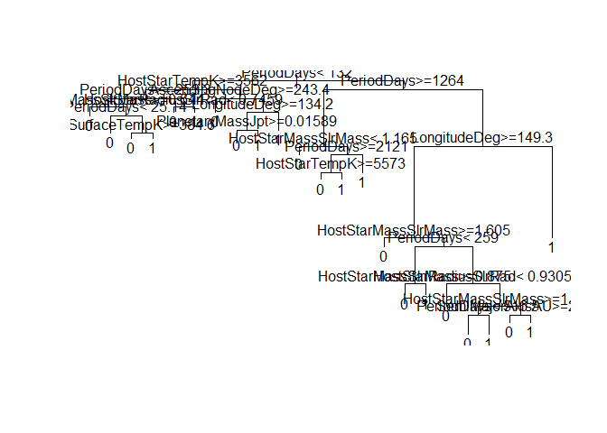

``` r
fancyRpartPlot(life_predicted_2) # This gives better plot
```

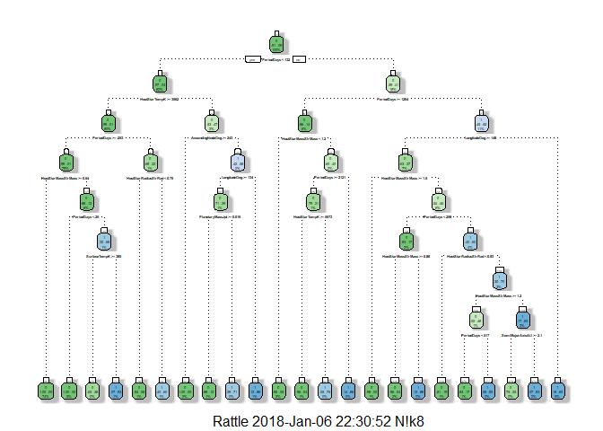

We can see here that the model has considered 'Peiod of Days &lt; 132' for split. Decision tree splits the nodes on all available variables and then selects the split which results in most homogeneous sub-nodes. Our Root Node has a ratio of .91 to .09 on 0(No Life). The consecutive Decision Nodes are HostStarTempK and PeriodDays&gt;=1254. We have 23 Terminal Nodes.

``` r
prediction_2 <- predict(life_predicted_2, test_2, type = "class")
```

``` r
results_2 <- data.frame(prediction_2, test_2$test_2_label)
 
accuracy_2  <- paste("Accuracy of Decision Tree Model is:", sum(prediction_2 == test_2$test_2_label)/length(prediction_2))
decisiontree <- sum(prediction_2 == test_2$test_2_label)/length(prediction_2)

confusionMatrix(table(results_2))
```

    ## Confusion Matrix and Statistics
    ## 
    ##             test_2.test_2_label
    ## prediction_2   0   1
    ##            0 634  15
    ##            1  20  47
    ##                                           
    ##                Accuracy : 0.9511          
    ##                  95% CI : (0.9327, 0.9657)
    ##     No Information Rate : 0.9134          
    ##     P-Value [Acc > NIR] : 7.73e-05        
    ##                                           
    ##                   Kappa : 0.7019          
    ##  Mcnemar's Test P-Value : 0.499           
    ##                                           
    ##             Sensitivity : 0.9694          
    ##             Specificity : 0.7581          
    ##          Pos Pred Value : 0.9769          
    ##          Neg Pred Value : 0.7015          
    ##              Prevalence : 0.9134          
    ##          Detection Rate : 0.8855          
    ##    Detection Prevalence : 0.9064          
    ##       Balanced Accuracy : 0.8637          
    ##                                           
    ##        'Positive' Class : 0               
    ## 

We get accuracy of 95.11% which is far better than KNN model. We can prune our model to avoid overfitting if any, or we can jump to Random Forest which betters the accuracy, as it constructs several decision trees on several variables and than does classification.

------------------------------------------------------------------------

#### Random Forest

``` r
#install.packages('randomForest')
library(randomForest)
```

    ## Warning: package 'randomForest' was built under R version 3.4.3

    ## randomForest 4.6-12

    ## Type rfNews() to see new features/changes/bug fixes.

    ## 
    ## Attaching package: 'randomForest'

    ## The following object is masked from 'package:rattle':
    ## 
    ##     importance

    ## The following object is masked from 'package:dplyr':
    ## 
    ##     combine

    ## The following object is masked from 'package:ggplot2':
    ## 
    ##     margin

``` r
set.seed(1234)
```

``` r
life_predicted_3 <- randomForest(train_2_label ~ PlanetaryMassJpt + RadiusJpt + PeriodDays + SemiMajorAxisAU + Eccentricity + PeriastronDeg + LongitudeDeg + AscendingNodeDeg + InclinationDeg + SurfaceTempK + AgeGyr + DiscoveryYear + DistFromSunParsec + HostStarMassSlrMass + HostStarRadiusSlrRad + HostStarMetallicity + HostStarTempK + HostStarAgeGyr + TypeFlag + DiscoveryMethod + ListsPlanetIsOn , data = train_2, importance = TRUE, ntree = 50) 
```

We want enough trees to stabilize the error but not so many that they over correlate the ensemble, which will lead to overfit so we keep ntree = 50.

``` r
varImpPlot(life_predicted_3)
```

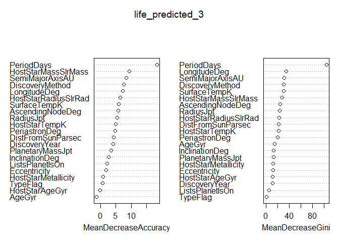

Higher the value of Gini higher the homogeneity. So split occurs accordingly.

``` r
plot(life_predicted_3, log="y")
```

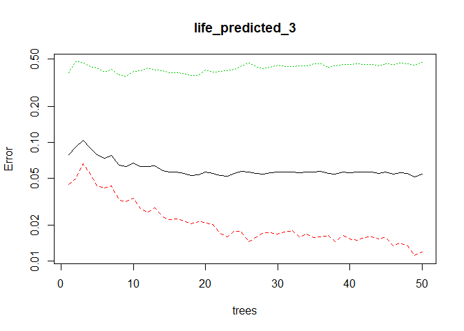

Across 50 trees the error rate decreased, we might increase the number of trees for more decreased error, but avoid it because of overfitting.

``` r
library("party")
```

    ## Loading required package: grid

    ## Loading required package: mvtnorm

    ## Loading required package: modeltools

    ## Loading required package: stats4

    ## Loading required package: strucchange

    ## Loading required package: zoo

    ## 
    ## Attaching package: 'zoo'

    ## The following objects are masked from 'package:base':
    ## 
    ##     as.Date, as.Date.numeric

    ## Loading required package: sandwich

``` r
x <- ctree(train_2_label ~ PlanetaryMassJpt + RadiusJpt + PeriodDays + SemiMajorAxisAU + Eccentricity + PeriastronDeg + LongitudeDeg + AscendingNodeDeg + InclinationDeg + SurfaceTempK + AgeGyr + DiscoveryYear + DistFromSunParsec + HostStarMassSlrMass + HostStarRadiusSlrRad + HostStarMetallicity + HostStarTempK + HostStarAgeGyr + TypeFlag + DiscoveryMethod + ListsPlanetIsOn , data = train_2)
plot(x, type="simple")
```

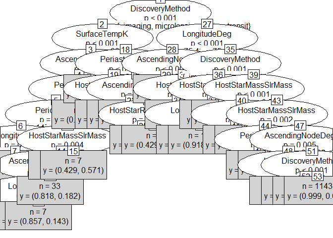

Here we see the splitting at Discovery Method. This plot has few good aspects. Like on 20th Terminal Node when the value of HostStarRadius is &lt;=1 , the y has value of 88.4% for Life = 1. Same results can be seen on 25, 37 termnal node, Also for transit we have 99% and transit 92% Life chance = 1.

``` r
prediction_3 <- predict(life_predicted_3, test_2, type='class')
results_3 <- data.frame(prediction_3, test_2$test_2_label)

accuracy_3  <- paste("Accuracy of Random Forest Model is:", sum(prediction_3 == test_2$test_2_label)/length(prediction_3))
randomforestRF <- sum(prediction_3 == test_2$test_2_label)/length(prediction_3)

confusionMatrix(table(results_3))
```

    ## Confusion Matrix and Statistics
    ## 
    ##             test_2.test_2_label
    ## prediction_3   0   1
    ##            0 647  25
    ##            1   7  37
    ##                                           
    ##                Accuracy : 0.9553          
    ##                  95% CI : (0.9375, 0.9692)
    ##     No Information Rate : 0.9134          
    ##     P-Value [Acc > NIR] : 1.02e-05        
    ##                                           
    ##                   Kappa : 0.6747          
    ##  Mcnemar's Test P-Value : 0.002654        
    ##                                           
    ##             Sensitivity : 0.9893          
    ##             Specificity : 0.5968          
    ##          Pos Pred Value : 0.9628          
    ##          Neg Pred Value : 0.8409          
    ##              Prevalence : 0.9134          
    ##          Detection Rate : 0.9036          
    ##    Detection Prevalence : 0.9385          
    ##       Balanced Accuracy : 0.7930          
    ##                                           
    ##        'Positive' Class : 0               
    ## 

We see a slight improvement at 95.53%.

------------------------------------------------------------------------

#### NaiveBayes

``` r
#library(e1071)
library(plyr)
```

    ## -------------------------------------------------------------------------

    ## You have loaded plyr after dplyr - this is likely to cause problems.
    ## If you need functions from both plyr and dplyr, please load plyr first, then dplyr:
    ## library(plyr); library(dplyr)

    ## -------------------------------------------------------------------------

    ## 
    ## Attaching package: 'plyr'

    ## The following object is masked from 'package:modeltools':
    ## 
    ##     empty

    ## The following objects are masked from 'package:dplyr':
    ## 
    ##     arrange, count, desc, failwith, id, mutate, rename, summarise,
    ##     summarize

``` r
life_predicted_4 <- naiveBayes(train_2_label ~ PlanetaryMassJpt + RadiusJpt + PeriodDays + SemiMajorAxisAU + Eccentricity + PeriastronDeg + LongitudeDeg + AscendingNodeDeg + InclinationDeg + SurfaceTempK + AgeGyr + DiscoveryYear + DistFromSunParsec + HostStarMassSlrMass + HostStarRadiusSlrRad + HostStarMetallicity + HostStarTempK + HostStarAgeGyr + TypeFlag + DiscoveryMethod + ListsPlanetIsOn , data = train_2)
```

``` r
summary(life_predicted_4)
```

    ##         Length Class  Mode     
    ## apriori  2     table  numeric  
    ## tables  21     -none- list     
    ## levels   2     -none- character
    ## call     4     -none- call

``` r
prediction_4 <- predict(life_predicted_4, test_2, type='class')
results_4 <- data.frame(prediction_4, test_2$test_2_label)

accuracy_4 <- paste("Accuracy of Naive Bayes Model is:", sum(prediction_4 == test_2$test_2_label)/length(prediction_4))
naivebayesNB <- sum(prediction_4 == test_2$test_2_label)/length(prediction_4)

confusionMatrix(table(results_4))
```

    ## Confusion Matrix and Statistics
    ## 
    ##             test_2.test_2_label
    ## prediction_4   0   1
    ##            0 554  27
    ##            1 100  35
    ##                                           
    ##                Accuracy : 0.8226          
    ##                  95% CI : (0.7926, 0.8499)
    ##     No Information Rate : 0.9134          
    ##     P-Value [Acc > NIR] : 1               
    ##                                           
    ##                   Kappa : 0.2685          
    ##  Mcnemar's Test P-Value : 1.67e-10        
    ##                                           
    ##             Sensitivity : 0.8471          
    ##             Specificity : 0.5645          
    ##          Pos Pred Value : 0.9535          
    ##          Neg Pred Value : 0.2593          
    ##              Prevalence : 0.9134          
    ##          Detection Rate : 0.7737          
    ##    Detection Prevalence : 0.8115          
    ##       Balanced Accuracy : 0.7058          
    ##                                           
    ##        'Positive' Class : 0               
    ## 

We get accuracy of 82.26%. Well this was to happen as Naive Bayes considers variables to be unrelated to each other.

------------------------------------------------------------------------

#### Logistic Regression

``` r
life_predicted_5 <- glm(train_2_label ~ PlanetaryMassJpt + RadiusJpt + PeriodDays + SemiMajorAxisAU + Eccentricity +  SurfaceTempK + AgeGyr + DiscoveryYear + DistFromSunParsec + HostStarMassSlrMass + HostStarRadiusSlrRad + HostStarMetallicity + HostStarTempK + HostStarAgeGyr  , family = binomial(link='logit'), data = train_2, control = list(maxit = 50))
```

    ## Warning: glm.fit: fitted probabilities numerically 0 or 1 occurred

``` r
prediction_5 <- predict(life_predicted_5, test_2, type = 'response')  # type='response', R will output probabilities in the form of P(y=1|X).
summary(prediction_5)
```

    ##    Min. 1st Qu.  Median    Mean 3rd Qu.    Max. 
    ## 0.00000 0.02386 0.05637 0.09562 0.12646 0.93229

``` r
# the observation is not (1,0)

prediction_5 <- as.numeric(prediction_5 > 0.5, 1, 0) 
# this step to convert the observation to be classified as 1 and 0 otherwise . We take decision boundary to be 0.5.

mean(as.numeric(prediction_5 > 0.5) != test_2$test_2_label) # test error
```

    ## [1] 0.08798883

``` r
# test error = 0.08  is pretty low

results_5 <- data.frame(prediction_5, test_2$test_2_label)

accuracy_5  <- paste("Accuracy of Logistic Regression Model is:", sum(prediction_5 == test_2$test_2_label)/length(prediction_5))
logisticregression <- sum(prediction_5 == test_2$test_2_label)/length(prediction_5)

confusionMatrix(table(results_5))
```

    ## Confusion Matrix and Statistics
    ## 
    ##             test_2.test_2_label
    ## prediction_5   0   1
    ##            0 648  57
    ##            1   6   5
    ##                                           
    ##                Accuracy : 0.912           
    ##                  95% CI : (0.8888, 0.9317)
    ##     No Information Rate : 0.9134          
    ##     P-Value [Acc > NIR] : 0.5858          
    ##                                           
    ##                   Kappa : 0.1139          
    ##  Mcnemar's Test P-Value : 2.988e-10       
    ##                                           
    ##             Sensitivity : 0.99083         
    ##             Specificity : 0.08065         
    ##          Pos Pred Value : 0.91915         
    ##          Neg Pred Value : 0.45455         
    ##              Prevalence : 0.91341         
    ##          Detection Rate : 0.90503         
    ##    Detection Prevalence : 0.98464         
    ##       Balanced Accuracy : 0.53574         
    ##                                           
    ##        'Positive' Class : 0               
    ## 

We get an accuracy of 91.2% which is less compred to other models, but it outperformed NaiveBayes. Usually logistic regression performs good for binary classification but with our variables it gives less accuracy compared to other models.

------------------------------------------------------------------------

#### Generalized Boosted Regression Models(GBM)

``` r
library(caret)
```

``` r
fitControl <- trainControl(method = "cv", number = 10) #5folds) # cross validation (cv) is used to determine the optimum number of trees. 
```

``` r
tune_Grid <-  expand.grid(interaction.depth = 2, # interaction.depth = 2, shrinkage = 0.1 came from a bit of experimenting.
                            n.trees = 500,      # n.trees has to be high enough that it is clear the optimum number of trees is lower than the number estimated.
                            shrinkage = 0.1,
                            n.minobsinnode = 20)
```

``` r
set.seed(1234)

#install.packages('gbm')

life_predicted_6 <- train(train_2_label ~ PlanetaryMassJpt + RadiusJpt + PeriodDays + SemiMajorAxisAU + Eccentricity + PeriastronDeg + LongitudeDeg + AscendingNodeDeg + InclinationDeg + SurfaceTempK + AgeGyr + DiscoveryYear + DistFromSunParsec + HostStarMassSlrMass + HostStarRadiusSlrRad + HostStarMetallicity + HostStarTempK + HostStarAgeGyr + TypeFlag + DiscoveryMethod , data = train_2,
                 method = "gbm",
                 trControl = fitControl,
                 verbose = FALSE,
                 tuneGrid = tune_Grid)
```

    ## Warning: package 'gbm' was built under R version 3.4.3

    ## Loading required package: survival

    ## 
    ## Attaching package: 'survival'

    ## The following object is masked from 'package:caret':
    ## 
    ##     cluster

    ## Loading required package: splines

    ## Loading required package: parallel

    ## Loaded gbm 2.1.3

``` r
prediction_6 <- predict(life_predicted_6, test_2, type = "raw") 
```

``` r
results_6 <- data.frame(prediction_6, test_2$test_2_label)

accuracy_6  <- paste("Accuracy of GBM Model is:", sum(prediction_6 == test_2$test_2_label)/length(prediction_6))
gbm <- sum(prediction_6 == test_2$test_2_label)/length(prediction_6)

confusionMatrix(table(results_6))
```

    ## Confusion Matrix and Statistics
    ## 
    ##             test_2.test_2_label
    ## prediction_6   0   1
    ##            0 650  17
    ##            1   4  45
    ##                                           
    ##                Accuracy : 0.9707          
    ##                  95% CI : (0.9555, 0.9818)
    ##     No Information Rate : 0.9134          
    ##     P-Value [Acc > NIR] : 4.239e-10       
    ##                                           
    ##                   Kappa : 0.7951          
    ##  Mcnemar's Test P-Value : 0.008829        
    ##                                           
    ##             Sensitivity : 0.9939          
    ##             Specificity : 0.7258          
    ##          Pos Pred Value : 0.9745          
    ##          Neg Pred Value : 0.9184          
    ##              Prevalence : 0.9134          
    ##          Detection Rate : 0.9078          
    ##    Detection Prevalence : 0.9316          
    ##       Balanced Accuracy : 0.8598          
    ##                                           
    ##        'Positive' Class : 0               
    ## 

We get an accuracy of 97.07% which is best yet. The more ntrees the more accuracy we observe here, but after that we will see overfitting.

------------------------------------------------------------------------

#### XGBoost

XgBoost accepts the missing values in it's prediction but we'll take our exosim dataframe.

``` r
# install.packages('xgboost')
library(xgboost)
```

    ## Warning: package 'xgboost' was built under R version 3.4.3

    ## 
    ## Attaching package: 'xgboost'

    ## The following object is masked from 'package:rattle':
    ## 
    ##     xgboost

    ## The following object is masked from 'package:dplyr':
    ## 
    ##     slice

``` r
library(readr)
```

    ## 
    ## Attaching package: 'readr'

    ## The following object is masked from 'package:scales':
    ## 
    ##     col_factor

``` r
library(stringr)
```

    ## 
    ## Attaching package: 'stringr'

    ## The following object is masked from 'package:strucchange':
    ## 
    ##     boundary

``` r
#library(caret)
#install.packages('car')
#library(car)
```

``` r
# create train data frame
train_3 <- exosim[oneortwo == 1, -26]

# create test data frame
test_3 <- exosim[oneortwo == 2, -26]

# create data frame to apply train and test upon
train_3_label <- label_1[oneortwo == 1]
test_3_label <- label_1[oneortwo == 2]
```

``` r
# convert every variable to numeric, even the integer variables
train_3 <- as.data.frame(lapply(train_3, as.numeric))
test_3 <- as.data.frame(lapply(test_3, as.numeric))
```

We must convert our data type to numeric, otherwise algorithm doesn’t work.

``` r
# convert data to xgboost format
data.train_3 <- xgb.DMatrix(data = data.matrix(train_3[, 1:ncol(train_3)]), label = train_3_label)
data.test_3 <- xgb.DMatrix(data = data.matrix(test_3[, 1:ncol(test_3)]), label = test_3_label)
```

``` r
watchlist <- list(train  = data.train_3, test = data.test_3)
```

``` r
parameters <- list(
    # General Parameters
    booster            = "gbtree",          # default = "gbtree"           # gbtree (tree based) or gblinear (linear function)
    silent             = 0,                 # default = 0                  # silent = 0 will stop results from displaying
    # Booster Parameters
    eta                = 0.3,               # default = 0.3, range: [0,1]  # Low eta value means model is more robust to overfitting.
    gamma              = 0,                 # default = 0,   range: [0,∞]  # Larger the gamma more conservative the algorithm is.
    max_depth          = 2,                 # default = 6,   range: [1,∞]  # less depth so to avoid overfitting
    min_child_weight   = 1,                 # default = 1,   range: [0,∞]  # It might help in logistic regression when class is extremely imbalanced. 
    subsample          = 1,                 # default = 1,   range: (0,1]  # 0.5 means that XGBoost randomly collected half of the data instances to grow trees, this will prevent overfitting.
    colsample_bytree   = 1,                 # default = 1,   range: (0,1]
    colsample_bylevel  = 1,                 # default = 1,   range: (0,1]
    lambda             = 1,                 # default = 1
    alpha              = 0,                 # default = 0
    # Task Parameters
    objective          = "multi:softmax",   # default = "reg:linear"
    eval_metric        = "mlogloss",
    num_class          = 20,
    seed               = 1234               # reproducability seed
    )
```

``` r
life_predicted_7 <- xgb.train(parameters, data.train_3, nrounds = 200, watchlist) # nrounds is like ntrees 
```

    ## [1]  train-mlogloss:0.848595 test-mlogloss:0.855311 
    ## [2]  train-mlogloss:0.648772 test-mlogloss:0.655745 
    ## [3]  train-mlogloss:0.515515 test-mlogloss:0.523792 
    ## [4]  train-mlogloss:0.419316 test-mlogloss:0.428498 
    ## [5]  train-mlogloss:0.349087 test-mlogloss:0.360824 
    ## [6]  train-mlogloss:0.296842 test-mlogloss:0.311005 
    ## [7]  train-mlogloss:0.257246 test-mlogloss:0.272192 
    ## [8]  train-mlogloss:0.226149 test-mlogloss:0.242690 
    ## [9]  train-mlogloss:0.201669 test-mlogloss:0.218959 
    ## [10] train-mlogloss:0.183082 test-mlogloss:0.202119 
    ## [11] train-mlogloss:0.167063 test-mlogloss:0.186259 
    ## [12] train-mlogloss:0.155396 test-mlogloss:0.175815 
    ## [13] train-mlogloss:0.144988 test-mlogloss:0.165979 
    ## [14] train-mlogloss:0.136727 test-mlogloss:0.159935 
    ## [15] train-mlogloss:0.128704 test-mlogloss:0.150701 
    ## [16] train-mlogloss:0.121931 test-mlogloss:0.144297 
    ## [17] train-mlogloss:0.116909 test-mlogloss:0.140568 
    ## [18] train-mlogloss:0.111194 test-mlogloss:0.135960 
    ## [19] train-mlogloss:0.106896 test-mlogloss:0.134084 
    ## [20] train-mlogloss:0.103400 test-mlogloss:0.132121 
    ## [21] train-mlogloss:0.100376 test-mlogloss:0.129357 
    ## [22] train-mlogloss:0.097167 test-mlogloss:0.127099 
    ## [23] train-mlogloss:0.094287 test-mlogloss:0.126002 
    ## [24] train-mlogloss:0.091830 test-mlogloss:0.124055 
    ## [25] train-mlogloss:0.088820 test-mlogloss:0.120556 
    ## [26] train-mlogloss:0.086475 test-mlogloss:0.119502 
    ## [27] train-mlogloss:0.084017 test-mlogloss:0.117415 
    ## [28] train-mlogloss:0.081919 test-mlogloss:0.115052 
    ## [29] train-mlogloss:0.080361 test-mlogloss:0.113580 
    ## [30] train-mlogloss:0.079000 test-mlogloss:0.112525 
    ## [31] train-mlogloss:0.077638 test-mlogloss:0.111750 
    ## [32] train-mlogloss:0.076111 test-mlogloss:0.109939 
    ## [33] train-mlogloss:0.074518 test-mlogloss:0.109353 
    ## [34] train-mlogloss:0.073453 test-mlogloss:0.109388 
    ## [35] train-mlogloss:0.072234 test-mlogloss:0.108091 
    ## [36] train-mlogloss:0.070616 test-mlogloss:0.106934 
    ## [37] train-mlogloss:0.069667 test-mlogloss:0.106663 
    ## [38] train-mlogloss:0.068318 test-mlogloss:0.105516 
    ## [39] train-mlogloss:0.066996 test-mlogloss:0.105927 
    ## [40] train-mlogloss:0.066392 test-mlogloss:0.106127 
    ## [41] train-mlogloss:0.065239 test-mlogloss:0.105590 
    ## [42] train-mlogloss:0.064123 test-mlogloss:0.104901 
    ## [43] train-mlogloss:0.063260 test-mlogloss:0.104247 
    ## [44] train-mlogloss:0.062227 test-mlogloss:0.102890 
    ## [45] train-mlogloss:0.061738 test-mlogloss:0.102245 
    ## [46] train-mlogloss:0.061225 test-mlogloss:0.102168 
    ## [47] train-mlogloss:0.060231 test-mlogloss:0.101023 
    ## [48] train-mlogloss:0.059266 test-mlogloss:0.100216 
    ## [49] train-mlogloss:0.058328 test-mlogloss:0.099188 
    ## [50] train-mlogloss:0.057582 test-mlogloss:0.099112 
    ## [51] train-mlogloss:0.056969 test-mlogloss:0.098774 
    ## [52] train-mlogloss:0.055863 test-mlogloss:0.097858 
    ## [53] train-mlogloss:0.055059 test-mlogloss:0.097515 
    ## [54] train-mlogloss:0.054451 test-mlogloss:0.097429 
    ## [55] train-mlogloss:0.053500 test-mlogloss:0.096530 
    ## [56] train-mlogloss:0.052923 test-mlogloss:0.095841 
    ## [57] train-mlogloss:0.052189 test-mlogloss:0.095961 
    ## [58] train-mlogloss:0.051419 test-mlogloss:0.094917 
    ## [59] train-mlogloss:0.050464 test-mlogloss:0.094052 
    ## [60] train-mlogloss:0.049867 test-mlogloss:0.093754 
    ## [61] train-mlogloss:0.049169 test-mlogloss:0.093121 
    ## [62] train-mlogloss:0.048570 test-mlogloss:0.092559 
    ## [63] train-mlogloss:0.047942 test-mlogloss:0.092062 
    ## [64] train-mlogloss:0.047354 test-mlogloss:0.092253 
    ## [65] train-mlogloss:0.046668 test-mlogloss:0.091667 
    ## [66] train-mlogloss:0.046280 test-mlogloss:0.091385 
    ## [67] train-mlogloss:0.045609 test-mlogloss:0.090770 
    ## [68] train-mlogloss:0.044687 test-mlogloss:0.090097 
    ## [69] train-mlogloss:0.044178 test-mlogloss:0.090249 
    ## [70] train-mlogloss:0.043711 test-mlogloss:0.089977 
    ## [71] train-mlogloss:0.043139 test-mlogloss:0.089398 
    ## [72] train-mlogloss:0.042580 test-mlogloss:0.088702 
    ## [73] train-mlogloss:0.042063 test-mlogloss:0.088169 
    ## [74] train-mlogloss:0.041534 test-mlogloss:0.087914 
    ## [75] train-mlogloss:0.040850 test-mlogloss:0.086330 
    ## [76] train-mlogloss:0.040544 test-mlogloss:0.086387 
    ## [77] train-mlogloss:0.040133 test-mlogloss:0.086306 
    ## [78] train-mlogloss:0.039601 test-mlogloss:0.085747 
    ## [79] train-mlogloss:0.038918 test-mlogloss:0.085404 
    ## [80] train-mlogloss:0.038520 test-mlogloss:0.084772 
    ## [81] train-mlogloss:0.038188 test-mlogloss:0.084433 
    ## [82] train-mlogloss:0.037725 test-mlogloss:0.083896 
    ## [83] train-mlogloss:0.037230 test-mlogloss:0.083635 
    ## [84] train-mlogloss:0.036778 test-mlogloss:0.084065 
    ## [85] train-mlogloss:0.036342 test-mlogloss:0.083603 
    ## [86] train-mlogloss:0.036025 test-mlogloss:0.083622 
    ## [87] train-mlogloss:0.035601 test-mlogloss:0.083172 
    ## [88] train-mlogloss:0.035188 test-mlogloss:0.083192 
    ## [89] train-mlogloss:0.034816 test-mlogloss:0.083973 
    ## [90] train-mlogloss:0.034384 test-mlogloss:0.083362 
    ## [91] train-mlogloss:0.034077 test-mlogloss:0.083263 
    ## [92] train-mlogloss:0.033658 test-mlogloss:0.083287 
    ## [93] train-mlogloss:0.033343 test-mlogloss:0.083819 
    ## [94] train-mlogloss:0.032422 test-mlogloss:0.082636 
    ## [95] train-mlogloss:0.032042 test-mlogloss:0.081769 
    ## [96] train-mlogloss:0.031615 test-mlogloss:0.081415 
    ## [97] train-mlogloss:0.031335 test-mlogloss:0.081030 
    ## [98] train-mlogloss:0.030960 test-mlogloss:0.080596 
    ## [99] train-mlogloss:0.030554 test-mlogloss:0.081521 
    ## [100]    train-mlogloss:0.030226 test-mlogloss:0.081071 
    ## [101]    train-mlogloss:0.029892 test-mlogloss:0.080625 
    ## [102]    train-mlogloss:0.029514 test-mlogloss:0.080129 
    ## [103]    train-mlogloss:0.029214 test-mlogloss:0.079842 
    ## [104]    train-mlogloss:0.028867 test-mlogloss:0.079642 
    ## [105]    train-mlogloss:0.028690 test-mlogloss:0.079486 
    ## [106]    train-mlogloss:0.028341 test-mlogloss:0.079360 
    ## [107]    train-mlogloss:0.028115 test-mlogloss:0.079383 
    ## [108]    train-mlogloss:0.027818 test-mlogloss:0.079274 
    ## [109]    train-mlogloss:0.027366 test-mlogloss:0.078803 
    ## [110]    train-mlogloss:0.026980 test-mlogloss:0.077957 
    ## [111]    train-mlogloss:0.026720 test-mlogloss:0.078344 
    ## [112]    train-mlogloss:0.026528 test-mlogloss:0.078513 
    ## [113]    train-mlogloss:0.026263 test-mlogloss:0.078066 
    ## [114]    train-mlogloss:0.025974 test-mlogloss:0.077814 
    ## [115]    train-mlogloss:0.025569 test-mlogloss:0.077522 
    ## [116]    train-mlogloss:0.025260 test-mlogloss:0.077059 
    ## [117]    train-mlogloss:0.025043 test-mlogloss:0.077645 
    ## [118]    train-mlogloss:0.024822 test-mlogloss:0.077953 
    ## [119]    train-mlogloss:0.024641 test-mlogloss:0.077989 
    ## [120]    train-mlogloss:0.024420 test-mlogloss:0.077802 
    ## [121]    train-mlogloss:0.023585 test-mlogloss:0.075976 
    ## [122]    train-mlogloss:0.023287 test-mlogloss:0.075490 
    ## [123]    train-mlogloss:0.023052 test-mlogloss:0.074915 
    ## [124]    train-mlogloss:0.022861 test-mlogloss:0.074596 
    ## [125]    train-mlogloss:0.022672 test-mlogloss:0.074842 
    ## [126]    train-mlogloss:0.022382 test-mlogloss:0.074389 
    ## [127]    train-mlogloss:0.022146 test-mlogloss:0.074586 
    ## [128]    train-mlogloss:0.021882 test-mlogloss:0.074457 
    ## [129]    train-mlogloss:0.021724 test-mlogloss:0.074303 
    ## [130]    train-mlogloss:0.021475 test-mlogloss:0.074264 
    ## [131]    train-mlogloss:0.021367 test-mlogloss:0.074194 
    ## [132]    train-mlogloss:0.021196 test-mlogloss:0.074086 
    ## [133]    train-mlogloss:0.020948 test-mlogloss:0.073821 
    ## [134]    train-mlogloss:0.020819 test-mlogloss:0.073612 
    ## [135]    train-mlogloss:0.020653 test-mlogloss:0.073450 
    ## [136]    train-mlogloss:0.020459 test-mlogloss:0.072938 
    ## [137]    train-mlogloss:0.020263 test-mlogloss:0.072834 
    ## [138]    train-mlogloss:0.020118 test-mlogloss:0.073371 
    ## [139]    train-mlogloss:0.019993 test-mlogloss:0.073458 
    ## [140]    train-mlogloss:0.019753 test-mlogloss:0.074046 
    ## [141]    train-mlogloss:0.019557 test-mlogloss:0.074278 
    ## [142]    train-mlogloss:0.019390 test-mlogloss:0.073948 
    ## [143]    train-mlogloss:0.019161 test-mlogloss:0.074281 
    ## [144]    train-mlogloss:0.018952 test-mlogloss:0.073473 
    ## [145]    train-mlogloss:0.018785 test-mlogloss:0.073443 
    ## [146]    train-mlogloss:0.018619 test-mlogloss:0.073560 
    ## [147]    train-mlogloss:0.018415 test-mlogloss:0.073345 
    ## [148]    train-mlogloss:0.018248 test-mlogloss:0.072884 
    ## [149]    train-mlogloss:0.018056 test-mlogloss:0.072758 
    ## [150]    train-mlogloss:0.017891 test-mlogloss:0.073371 
    ## [151]    train-mlogloss:0.017747 test-mlogloss:0.073129 
    ## [152]    train-mlogloss:0.017590 test-mlogloss:0.073316 
    ## [153]    train-mlogloss:0.017315 test-mlogloss:0.073177 
    ## [154]    train-mlogloss:0.017052 test-mlogloss:0.072752 
    ## [155]    train-mlogloss:0.016759 test-mlogloss:0.072820 
    ## [156]    train-mlogloss:0.016610 test-mlogloss:0.072883 
    ## [157]    train-mlogloss:0.016448 test-mlogloss:0.072813 
    ## [158]    train-mlogloss:0.016307 test-mlogloss:0.072635 
    ## [159]    train-mlogloss:0.016178 test-mlogloss:0.072117 
    ## [160]    train-mlogloss:0.016071 test-mlogloss:0.072035 
    ## [161]    train-mlogloss:0.015901 test-mlogloss:0.071435 
    ## [162]    train-mlogloss:0.015741 test-mlogloss:0.071214 
    ## [163]    train-mlogloss:0.015620 test-mlogloss:0.071278 
    ## [164]    train-mlogloss:0.015471 test-mlogloss:0.071346 
    ## [165]    train-mlogloss:0.015269 test-mlogloss:0.071145 
    ## [166]    train-mlogloss:0.015139 test-mlogloss:0.071305 
    ## [167]    train-mlogloss:0.015006 test-mlogloss:0.070635 
    ## [168]    train-mlogloss:0.014889 test-mlogloss:0.070713 
    ## [169]    train-mlogloss:0.014743 test-mlogloss:0.070759 
    ## [170]    train-mlogloss:0.014625 test-mlogloss:0.070434 
    ## [171]    train-mlogloss:0.014529 test-mlogloss:0.070516 
    ## [172]    train-mlogloss:0.014429 test-mlogloss:0.070523 
    ## [173]    train-mlogloss:0.014353 test-mlogloss:0.070567 
    ## [174]    train-mlogloss:0.014214 test-mlogloss:0.070252 
    ## [175]    train-mlogloss:0.014055 test-mlogloss:0.070116 
    ## [176]    train-mlogloss:0.013941 test-mlogloss:0.070425 
    ## [177]    train-mlogloss:0.013578 test-mlogloss:0.069230 
    ## [178]    train-mlogloss:0.013433 test-mlogloss:0.069272 
    ## [179]    train-mlogloss:0.013334 test-mlogloss:0.069184 
    ## [180]    train-mlogloss:0.013208 test-mlogloss:0.068508 
    ## [181]    train-mlogloss:0.013011 test-mlogloss:0.068943 
    ## [182]    train-mlogloss:0.012871 test-mlogloss:0.069136 
    ## [183]    train-mlogloss:0.012769 test-mlogloss:0.069324 
    ## [184]    train-mlogloss:0.012670 test-mlogloss:0.069492 
    ## [185]    train-mlogloss:0.012580 test-mlogloss:0.069158 
    ## [186]    train-mlogloss:0.012446 test-mlogloss:0.068685 
    ## [187]    train-mlogloss:0.012354 test-mlogloss:0.068637 
    ## [188]    train-mlogloss:0.012229 test-mlogloss:0.068031 
    ## [189]    train-mlogloss:0.012170 test-mlogloss:0.067779 
    ## [190]    train-mlogloss:0.012096 test-mlogloss:0.067621 
    ## [191]    train-mlogloss:0.011982 test-mlogloss:0.067521 
    ## [192]    train-mlogloss:0.011872 test-mlogloss:0.067190 
    ## [193]    train-mlogloss:0.011759 test-mlogloss:0.067547 
    ## [194]    train-mlogloss:0.011641 test-mlogloss:0.067205 
    ## [195]    train-mlogloss:0.011545 test-mlogloss:0.067332 
    ## [196]    train-mlogloss:0.011492 test-mlogloss:0.067276 
    ## [197]    train-mlogloss:0.011409 test-mlogloss:0.067190 
    ## [198]    train-mlogloss:0.011301 test-mlogloss:0.067195 
    ## [199]    train-mlogloss:0.011208 test-mlogloss:0.067080 
    ## [200]    train-mlogloss:0.011116 test-mlogloss:0.067001

``` r
prediction_7 <- predict(life_predicted_7, data.test_3)
summary(prediction_7)
```

    ##    Min. 1st Qu.  Median    Mean 3rd Qu.    Max. 
    ##   1.000   1.000   1.000   1.073   1.000   2.000

``` r
# values are (1,2) but we need (0,1)

prediction_7 <- as.numeric(prediction_7 > 1.5) 
summary(prediction_7)
```

    ##    Min. 1st Qu.  Median    Mean 3rd Qu.    Max. 
    ## 0.00000 0.00000 0.00000 0.07263 0.00000 1.00000

``` r
# this step to convert values  (1,2) to (0,1) in prediction_7

results_7 <- data.frame(prediction_7, test_3_label)

accuracy_7  <- paste("Accuracy of XGBoost Model is:", sum(prediction_7 == test_3_label)/length(prediction_7))
xgboostXGB <- sum(prediction_7 == test_3_label)/length(prediction_7)

confusionMatrix(table(results_7))
```

    ## Confusion Matrix and Statistics
    ## 
    ##             test_3_label
    ## prediction_7   0   1
    ##            0 650  14
    ##            1   4  48
    ##                                          
    ##                Accuracy : 0.9749         
    ##                  95% CI : (0.9606, 0.985)
    ##     No Information Rate : 0.9134         
    ##     P-Value [Acc > NIR] : 1.1e-11        
    ##                                          
    ##                   Kappa : 0.8286         
    ##  Mcnemar's Test P-Value : 0.03389        
    ##                                          
    ##             Sensitivity : 0.9939         
    ##             Specificity : 0.7742         
    ##          Pos Pred Value : 0.9789         
    ##          Neg Pred Value : 0.9231         
    ##              Prevalence : 0.9134         
    ##          Detection Rate : 0.9078         
    ##    Detection Prevalence : 0.9274         
    ##       Balanced Accuracy : 0.8840         
    ##                                          
    ##        'Positive' Class : 0              
    ## 

We get an accuracy of 97.49% which is best. nrounds = 200 really works, we could further improve accuracy with higher values of nrounds.

------------------------------------------------------------------------

Accuracy of our Models:

``` r
accuracy_1
```

    ## [1] "Accuracy of KNN Model is: 0.914804469273743"

``` r
accuracy_2
```

    ## [1] "Accuracy of Decision Tree Model is: 0.951117318435754"

``` r
accuracy_3
```

    ## [1] "Accuracy of Random Forest Model is: 0.955307262569832"

``` r
accuracy_4
```

    ## [1] "Accuracy of Naive Bayes Model is: 0.822625698324022"

``` r
accuracy_5
```

    ## [1] "Accuracy of Logistic Regression Model is: 0.912011173184358"

``` r
accuracy_6
```

    ## [1] "Accuracy of GBM Model is: 0.970670391061452"

``` r
accuracy_7
```

    ## [1] "Accuracy of XGBoost Model is: 0.974860335195531"

``` r
models <- c( knn, decisiontree, randomforestRF, naivebayesNB, logisticregression, gbm, xgboostXGB)

barplot(models,
  main = "Accuracy Plot",
  ylim = c(0,1.2),
  #horiz = TRUE,
  las=2,
  names.arg = c("knn", "DTree", "RF", "NB", "LogisticR", "GBM", "XGBoost"),
  col =  gray.colors(length(unique(models)))[as.factor(models)])

text(0.8, 1.1, "91.49")
text(1.9, 1.1, "95.12")
text(3.0, 1.1, "95.53")
text(4.3, 1.1, "82.26")
text(5.5, 1.1, "91.20")
text(6.7, 1.1, "97.06")
text(7.9, 1.1, "97.49")
```

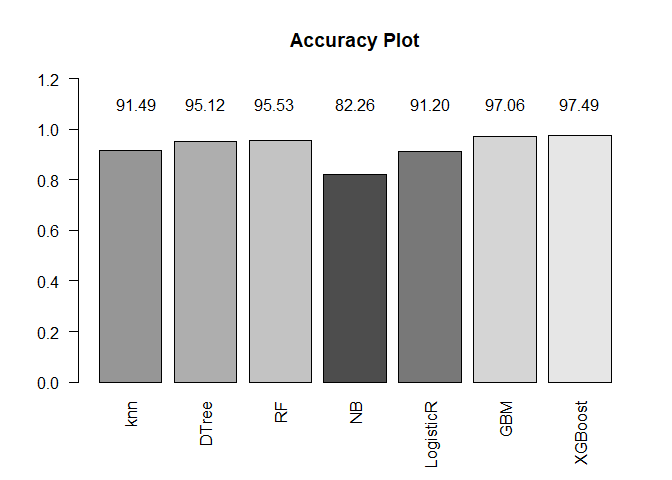
